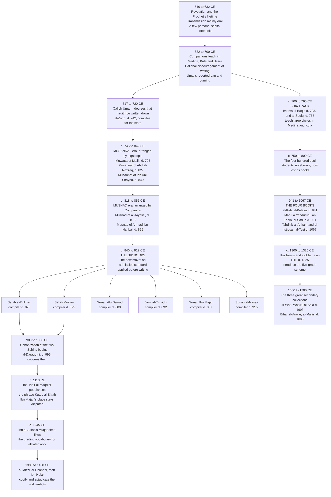

# The Hadith Controversy: Quran-Alone vs. Mainstream Islam

> **About this document.** It opens with **why** the question matters — the practical harm
> done when a newcomer to Islam is handed contradictory reports instead of the Quran — then
> states **the core argument** it defends, then explains the **date systems** and gives a
> **chronology** of the collections. Only after that comes the history. Part One reproduces an
> AI-assisted conversation on the authority of hadith. Part Two is separate verification
> research, which corrects several claims in Part One, adds the academic scholarship on hadith
> transmission, and supplies the mainstream replies the original conversation left out. Part
> Three is a technical reference on how the collections were compiled, how chains are
> authenticated, and how each tradition grades what it holds — Sunni, Twelver Shia, Zaydi,
> Ismaili, and Ibadi. Part Four is source criticism: what genre each cited work belongs to and
> what a citation to it can actually support. Parts Two through Four were researched on Aug. 21,
> 2026; the opening sections and the chronology on Aug. 23, 2026. Where later material conflicts
> with Part One, it is the better sourced. The argument stated up front is a position, and the
> sections that state it also state what they must concede. None of it substitutes for the
> primary texts.

## Contents

**[Why This Question Matters](#why-this-question-matters)**

- [1. The Problem This Document Exists to Address](#1-the-problem-this-document-exists-to-address)
- [2. What the Quran Says About Itself](#2-what-the-quran-says-about-itself)
- [3. Where the Reports Contradict the Text](#3-where-the-reports-contradict-the-text)
- [4. Where the Reports Make the Religion Harder Than the Quran Made It](#4-where-the-reports-make-the-religion-harder-than-the-quran-made-it)
- [5. What Follows From This, and What Does Not](#5-what-follows-from-this-and-what-does-not)

**[The Core Argument: The Cow, the Question, and the Room God Left](#the-core-argument-the-cow-the-question-and-the-room-god-left)**

- [1. The Book Announces Itself as Guidance](#1-the-book-announces-itself-as-guidance)
- [2. The Story of the Cow](#2-the-story-of-the-cow)
- [3. What the Story Diagnoses](#3-what-the-story-diagnoses)
- [4. Silence as Mercy](#4-silence-as-mercy)
- [5. The Position](#5-the-position)
- [6. What This Position Must Accept](#6-what-this-position-must-accept)

**[A Note on Dates: C.E., B.C.E., and A.H.](#a-note-on-dates-ce-bce-and-ah)**

**[Chronology of the Collections](#chronology-of-the-collections)**

**Part One: [The Original Conversation](#part-one-the-original-conversation)**

- [What the Quran Says About Following Other Books](#what-the-quran-says-about-following-other-books)
- [Does This Mean Muslims Should Reject the Books of Hadith?](#does-this-mean-muslims-should-reject-the-books-of-hadith)
- [History of the Hadith Collections](#history-of-the-hadith-collections)
- [Did Umar Order Hadith Manuscripts Burned?](#did-umar-order-hadith-manuscripts-burned)
- [From Ban to Full Documentation](#from-ban-to-full-documentation)
- [Are the Hadith Books Considered Religious Law?](#are-the-hadith-books-considered-religious-law)
- [The Two Arguments, With Examples](#the-two-arguments-with-examples)
- [Further Examples From Both Sides](#further-examples-from-both-sides)

**Part Two: [Independent Research Findings](#part-two-independent-research-findings)**

- [1. Corrections and Clarifications](#1-corrections-and-clarifications)
- [2. Where Academic Scholarship Stands](#2-where-academic-scholarship-stands)
- [3. The Spectrum Is Wider Than Two Camps](#3-the-spectrum-is-wider-than-two-camps)
- [4. The Mainstream Replies the Document Omits](#4-the-mainstream-replies-the-document-omits)
- [5. What the Disagreement Is Actually About](#5-what-the-disagreement-is-actually-about)

**Part Three: [Compilation, Authentication, and Grading](#part-three-compilation-authentication-and-grading)**

- [1. Anatomy of a Hadith](#1-anatomy-of-a-hadith)
- [2. How the Sunni Collections Were Physically Assembled](#2-how-the-sunni-collections-were-physically-assembled)
- [3. The Authentication Apparatus](#3-the-authentication-apparatus)
- [4. Named Transmitters](#4-named-transmitters)
- [5. Timeline](#5-timeline)
- [6. The Sunni Grading System in Detail](#6-the-sunni-grading-system-in-detail)
- [7. The Twelver Shia System](#7-the-twelver-shia-system)
- [8. Zaydi Shia](#8-zaydi-shia)
- [9. Ismaili Shia](#9-ismaili-shia)
- [10. Ibadi](#10-ibadi)
- [11. Comparison Across Traditions](#11-comparison-across-traditions)
- [12. What the Comparison Shows](#12-what-the-comparison-shows)

**Part Four: [Source Criticism — Histories Are Not Hadith Collections](#part-four-source-criticism--histories-are-not-hadith-collections)**

- [1. Al-Tabari's *History of the Prophets and Kings*](#1-al-tabaris-history-of-the-prophets-and-kings)
- [2. The Genres, and What Each Can Support](#2-the-genres-and-what-each-can-support)
- [3. What This Does to the Arguments in Parts One and Two](#3-what-this-does-to-the-arguments-in-parts-one-and-two)

**[Sources Referenced](#sources-referenced)**

---

# Why This Question Matters

This document is long and technical. The reason for it is not.

## 1. The Problem This Document Exists to Address

Someone comes to Islam — new to it, considering it, or born into it and asking a real question
for the first time. They ask something simple. *What does Islam say about this?*

They are very often not handed the Quran. They are handed a hadith. Frequently several, drawn
from different collections, carrying different gradings, sometimes disagreeing with each other,
and occasionally saying the opposite of what the Quran says. The enquirer, reasonably, draws one
of two conclusions. Either the religion is a thicket of rulings no ordinary person could
navigate without a specialist, or it asks them to believe things the Quran itself denies.

Both conclusions are avoidable. Both follow from the same mistake — going first to a secondary,
humanly transmitted body of reports rather than to the book the religion claims as its
criterion.

## 2. What the Quran Says About Itself

Before weighing what the reports say, it is worth registering the claims the Quran makes about
its own sufficiency, clarity, and lightness.

> **(2:2)** This is the Book! There is no doubt about it — a guide for those mindful ˹of
> Allah˺,

> **(6:114)** Should I seek a judge other than Allah while He is the One Who has revealed for
> you the Book with the truth perfectly explained?

> **(2:185)** ...Allah intends ease for you, not hardship...

> **(5:87)** O believers! Do not forbid the good things which Allah has made lawful for you,
> and do not transgress. Indeed, Allah does not like transgressors.

> **(7:32)** Ask, ˹O Prophet,˺ "Who has forbidden the adornments and lawful provisions Allah
> has brought forth for His servants?"

Read together these establish a posture rather than a rulebook. The Book is *guidance*
(*hudan*), it is *perfectly explained* (*mufassalan*), it intends *ease* not hardship, and it
warns believers specifically against **adding prohibitions of their own**. That last point is
the one most relevant to what follows, because 5:87 and 7:32 are not neutral on the question of
a growing body of restrictions. They are hostile to it.

## 3. Where the Reports Contradict the Text

The examples below are the ones most often put to newcomers, and they are the sharpest cases
where a report in the canonical collections says something the Quran appears to rule out. Each
is given with its location and the verse that stands against it.

| The report | Where | What the Quran says |
| --- | --- | --- |
| God created Adam **in His image** | Bukhari 6227, Muslim 2612, via Abu Hurayra | 112:4 "there is none comparable to Him"; 42:11 "there is nothing like Him" |
| Gold and silk are **forbidden to men** | Abu Dawud 4057, al-Nasa'i 5144, Ibn Majah 3595, via Ali | 7:32 "who has forbidden the adornments...?"; 5:87 "do not forbid the good things"; and 18:31, 22:23, 35:33 promise gold bracelets to believers with no gender attached |
| Married adulterers are **stoned to death** | Bukhari, Muslim | 24:2 prescribes one hundred lashes, with no distinction by marital status and no mention of stoning anywhere in the text |
| Whoever **changes his religion, kill him** | Bukhari 6922, via Ikrima from Ibn Abbas | 2:256 "there is no compulsion in religion"; 18:29 "whoever wills, let him believe; whoever wills, let him disbelieve" |
| Prayer is annulled by **a woman, a donkey and a dog** passing | Abu Dawud, Muslim, via Abu Hurayra | Nowhere in the Quran. Aisha is reported to have answered it directly: "You have compared us to donkeys and dogs" |
| Woman was **created from a crooked rib** | Bukhari, Muslim | 4:1 and 7:189 have God create humanity from a single soul and its mate from it — a common origin, not a defective derivative |
| The sun **prostrates beneath God's throne** at night | Bukhari | 36:38-40 describes the sun running a course, each body swimming in its own orbit |
| Dip a **fly** fully into your drink, one wing carries disease and the other cure | Bukhari 5782 | No Quranic basis; the Quran attributes no medical instruction to the Prophet |

Two of these are worth dwelling on, because they show two different kinds of failure.

**The image hadith is a theological failure.** Surah al-Ikhlas is four verses long and exists to
foreclose exactly this. It says God is One, self-sufficient, unbegotten and unbegetting, and
that *there is none comparable to Him*. Surah 42:11 repeats it in five words. A report that
God made Adam in His image invites the one comparison the Quran spends whole chapters
excluding. The tradition is aware of the difficulty and has answers — read the pronoun as
referring to Adam rather than God, or read the resemblance as partial and non-physical, on the
analogy of a report describing the first group in Paradise as being "in the image of the moon."
Those answers may work. But note what has happened: the enquirer now needs a specialist to
explain why a canonical report does not mean what it says, in order to protect a doctrine the
Quran had already stated plainly and without help.

**The gold prohibition is a legal failure.** There is no verse forbidding gold to anyone. What
the Quran does contain is 7:32, which asks who presumed to forbid the adornments God provided,
and 5:87, which instructs believers not to forbid the good things God made lawful. It also
promises gold bracelets to the people of Paradise three separate times — at 18:31, 22:23 and
35:33 — without once specifying that only women will wear them. A prohibition on half the
community wearing a particular metal rests entirely on solitary reports, and it runs against
the grain of the verses that speak to the subject. Whatever its status in *fiqh*, it cannot be
presented to a newcomer as something *the Quran* asks of them, because it is not.

**In fairness.** Mainstream scholarship has developed answers to every item in that table, and
several are more substantial than a newcomer would guess. [Part Two, section 4](#4-the-mainstream-replies-the-document-omits)
sets those answers out at length, including cases where the objection is shared by classical
jurists rather than being a modern invention. Nothing here claims these are knock-down cases.
The claim is narrower and harder to dispute: **a person cannot be handed this material first
and be expected to make sense of it.**

## 4. Where the Reports Make the Religion Harder Than the Quran Made It

Contradiction is the loud problem. Accumulation is the bigger one.

The Quran forbids a short list of foods. The developed law runs to volumes. The Quran commands
modest dress; the tradition specifies garments. The Quran commands prayer; the manuals specify
which foot enters the mosque first, and how far the fingers spread. None of that detail is
illegitimate as jurisprudence. All of it becomes a problem the moment it is presented as the
entry requirement for belief.

The Quran anticipates this directly.

> **(5:101)** O believers! Do not ask about any matter which, if made clear to you, may
> disturb you...

And the hadith corpus preserves the same warning against itself. The Prophet is reported in
Sahih Muslim to have announced the obligation of hajj, and a man asked whether it was due every
year. The Prophet stayed silent. The man asked three times. The answer, when it came, was that
had he said yes it would have become a yearly obligation and would have been beyond the
people's capacity — followed by the instruction to leave him alone as long as he left them
alone, and the warning that earlier communities were ruined because they put too many questions
to their prophets and then disagreed about the answers.

That is a hadith arguing against the over-extension of hadith, and it is worth more than any
argument this document could construct.

## 5. What Follows From This, and What Does Not

**What follows.** The Quran comes first, and everything else is measured against it. Where a
report clarifies the Quran and the community has carried its practice continuously — the form
of the prayer being the clearest case — it is a genuine inheritance and should be received as
one. Where a report contradicts the Quran's own moral or theological framework, the Quran
governs. Where a report adds a prohibition the Quran does not contain, the burden of proof sits
with the prohibition, not with the person declining it. A newcomer should be handed the Quran,
and should be told plainly that it is enough to begin.

**What does not follow.** That the corpus is worthless, that the scholars who built it were
dishonest, or that fourteen centuries of jurisprudence can be waved away. The apparatus
described in Part Three below is one of the most serious intellectual achievements of the premodern
world, and the men who built it were trying to solve a real problem honestly. The argument here
is about **order and weight**, not about worth.

The rest of this document is the history, told straight — where the collections came from, how
they were vetted, what the grading actually certifies, and what each kind of source can and
cannot support.

---

# The Core Argument: The Cow, the Question, and the Room God Left

This section states the position the document defends. It was drafted as the conclusion and
sits here instead, because a reader deserves the argument before the apparatus rather than
after it. Everything from Part One onward is the evidence the argument is answerable to.

The case is made from the Quran itself rather than from the historical and academic material,
which is why it can be read before any of it.

## 1. The Book Announces Itself as Guidance

Surah al-Baqarah opens with three letters and then a claim about the nature of what follows.

> **(2:1)** Alif-Lãm-Mĩm.

> **(2:2)** This is the Book! There is no doubt about it — a guide for those mindful ˹of
> Allah˺,

The opening is worth reading slowly, because it makes a specific claim and not a general one.
The Book is *hudan*, guidance. It is not announced as a code, a manual, or a register of
particulars. And the guidance is qualified by its audience — *lil-muttaqin*, for those mindful
of God. Guidance presumes someone who receives it and then acts, exercising judgment in
conditions the text does not enumerate. A code does the deciding for its reader. Guidance
requires the reader to decide.

The three letters that precede the claim are themselves instructive. The tradition has never
established what *Alif Lam Mim* means, and the standard exegetical position is that its meaning
rests with God. The Book therefore begins by declining to explain something, and immediately
declares itself free of doubt. Clarity of purpose and completeness of detail are not the same
property, and the first two verses of the longest surah demonstrate the difference before any
ruling is given.

## 2. The Story of the Cow

The same surah, named after this episode, records what happens when a community meets a divine
command and asks for particulars instead of obeying it.

> **(2:67)** And ˹remember˺ when Moses said to his people, "Allah commands you to sacrifice a
> cow." They replied, "Are you mocking us?" Moses responded, "I seek refuge in Allah from
> acting foolishly!"

> **(2:68)** They said, "Call upon your Lord to clarify for us what type ˹of cow˺ it should
> be!" He replied, "Allah says, 'The cow should neither be old nor young but in between. So do
> as you are commanded!'"

> **(2:69)** They said, "Call upon your Lord to specify for us its colour." He replied, "Allah
> says, 'It should be a bright yellow cow — pleasant to see.'"

> **(2:70)** Again they said, "Call upon your Lord so that He may make clear to us which cow,
> for all cows look the same to us. Then, Allah willing, we will be guided ˹to the right one˺."

> **(2:71)** He replied, "Allah says, 'It should have been used neither to till the soil nor
> water the fields; wholesome and without blemish.'" They said, "Now you have come with the
> truth." Yet they still slaughtered it hesitantly!

> **(2:72)** ˹This is˺ when a man was killed and you disputed who the killer was, but Allah
> revealed what you concealed.

> **(2:73)** So We instructed, "Strike the dead body with a piece of the cow." This is how
> ˹easily˺ Allah brings the dead to life, showing you His signs so that you may understand.

Read the sequence as a sequence. The original command is four words long and any cow in Israel
would have satisfied it. Then comes the first question, and with it the first restriction —
neither old nor young. Then the second question, and a colour requirement. Then a third
question, and the animal must never have been worked and must be without blemish. By the end
the community has talked itself from *any cow* into a single animal of a specified age, colour,
and history, which the classical commentaries describe them as having to search for and buy at
great expense. And when they finally have their answer, the verse does not record relief. It
records that they slaughtered it hesitantly.

Every added specification came from asking rather than from the original command. Nothing was
withheld from them at the outset; the narrowing was self-inflicted, and each answer they
extracted made obedience harder than it had been before they asked.

## 3. What the Story Diagnoses

The episode is not a story about cows. It is a diagnosis of a permanent human disposition, and
the Quran preserves it as such — giving the longest surah in the Book its name from a single
animal that was never specified until a community insisted on specifying it.

The disposition is the demand for detail. It presents itself as scrupulousness and often is
sincere. Its practical effect is to convert a command a person could have carried out
immediately into a research problem requiring an authority to resolve. And it has one further
effect the story makes explicit at 2:70, where the questioners frame their third demand as a
condition of being guided at all. They will be guided, God willing, *once they know which cow*.
Guidance has quietly been made contingent on information rather than on obedience.

This is the mechanism, stated in the Quran's own terms, that produces the reliance on hadith
this document has spent four parts examining. The Quran commands prayer without enumerating
units, commands charity without stating a percentage, commands modest dress without specifying
a garment. Faced with that, the same disposition asks the same question the Israelites asked —
*which cow?* — and it must then go somewhere for an answer. The corpus described in Parts Two
and Three is where it went: a vast, serious, sophisticated apparatus assembled by honest people
to supply particulars the Quran did not supply. Parts Three and Four also established what that
apparatus can and cannot deliver. It authenticates transmission, not occurrence. Its grading
vocabulary postdates the collections by four centuries. Almost no ruling in it rests on a
mass-transmitted report. And by its own account it contains material its own critics judged
defective.

None of that makes the corpus worthless. It makes it a human answer to a human question — and
the question, on the evidence of 2:67-71, was one the Book did not ask its readers to raise.

## 4. Silence as Mercy

The natural reading of an undetailed command is that something is missing from it. Al-Baqarah
suggests the opposite, and two further passages make the point directly.

> **(5:101)** O believers! Do not ask about any matter which, if made clear to you, may disturb
> you. But if you inquire about what is being revealed in the Quran, it will be made clear to
> you. Allah has forgiven what was done ˹in the past˺. And Allah is All-Forgiving, Most
> Forbearing.

The verse does not merely discourage certain questions. It states that some answers would harm
the questioner, which means the absence of the answer is a benefit rather than a gap. Silence
is being described as protection.

The tradition preserves the same principle in a report whose irony is worth noting, since it is
a hadith arguing against the over-extension of hadith. The Prophet is reported in Sahih Muslim
to have announced the obligation of hajj, and a man asked whether it was due every year. The
Prophet stayed silent. The man asked three times. The answer, when it came, was that had he
said yes it would have become a yearly obligation and would have been beyond the people's
capacity — followed by the instruction to leave him alone as long as he left them alone, and
the warning that earlier communities were ruined because they put too many questions to their
prophets and then disagreed about the answers.

Take those two together and the structure of the mercy is visible. A detailed command binds
every case identically, including the cases it fits badly. A general command binds the purpose
and leaves the application to the person, the place, and the circumstance. The undetailed
command is therefore the more generous of the two. It carries latitude that a specified one
could not carry, and the latitude is not an oversight to be repaired but a provision to be
used. The Israelites were given a command with enormous latitude — any cow — and spent that
latitude on questions until nothing was left of it.

## 5. The Position

The Quran calls itself guidance for those mindful of God, and guidance is addressed to a
faculty. God gave human beings reason, conscience, moral perception, and the capacity to weigh
a situation, and the Book repeatedly directs them to use these — to reflect, to consider, to
understand, as 2:73 itself concludes. A revelation that intended to remove the need for
judgment would have been written as a code, and it was not.

What follows for the question this document has examined is a position rather than a proof.

Muslims are not obliged to make the hadith corpus the sole route to a decision. The Quran is
sufficient as guidance because it is guidance and does not claim to be an exhaustive rulebook,
and a believer who reads it carefully and acts on it with sincerity, reason, and attention to
circumstance is doing what the Book asks. Where the corpus preserves what is plainly the
Prophet's practice, and where the community has carried that practice continuously, it is a
genuine and valuable inheritance — the manner of the prayer being the clearest case. Where it
supplies particulars the Quran declined to supply, and does so on the strength of a solitary
report transmitted for two centuries and graded four centuries later, it is human testimony
about the past and should be weighed as such rather than treated as beyond examination. And
where a report contradicts the Quran's own moral and theological framework, the Quran governs.
That is not a rejection of the tradition. It is the ordering the tradition itself claims to
observe, applied consistently.

The mistake the cow story identifies is not asking questions. Inquiry is honourable, and the
scholars who built the apparatus described in Part Three were engaged in inquiry of a high order. The
mistake is making obedience wait on a level of detail that was never required, and then
treating the answers so obtained as though they carried the authority of the command itself.
The Israelites did receive their specifications. They received them because they insisted, and
the specifications cost them their freedom of action and left them slaughtering the animal
reluctantly. The command they had at the beginning was easier, wider, and entirely sufficient.

## 6. What This Position Must Accept

Stated honestly, in keeping with the rest of this document, the position above carries three
liabilities and should not be advanced without them.

- **It grants interpretive weight to the individual reader.** Part Two, section 5 observes that
  relocating authority to the reader is why Quran-centred positions fragment in practice, and
  the objection holds here. Latitude used carelessly becomes licence, and the discipline that
  guidance requires is harder to sustain alone than within a scholarly tradition
- **It cannot do without transmitted practice entirely.** The form of the prayer is not
  derivable from the Quran, and it reaches every Muslim through the community's continuous
  practice. A position that leans on that inheritance for the pillars while discounting it
  elsewhere owes an account of where the line falls and why
- **The mainstream reply is not answered by this argument.** As Part One and Part Two,
  section 4 both set out below, mainstream scholarship holds that the
  Prophet's role was precisely to clarify what was revealed, on the authority of 16:44, and
  that the community that received the Quran understood it that way. This conclusion argues
  that the clarification was narrower and the latitude wider than the corpus later became. It
  does not establish that the corpus should be set aside, and it is not offered as establishing
  it

What it does establish, on the Quran's own testimony in al-Baqarah, is that a command left
general is not a command left incomplete, and that a believer standing before such a command is
not required to find out which cow before obeying.

---

# A Note on Dates: C.E., B.C.E., and A.H.

Every date in this document is given in **C.E.** Since the sources it draws on use two
different calendars, and readers arrive with different assumptions about both, the systems are
worth stating once.

## The three notations

**C.E. — Common Era.** Numerically identical to **A.D.** (*Anno Domini*, "in the year of the
Lord"). 870 C.E. and A.D. 870 are the same year. The only difference is the label: C.E. carries
no theological assertion in the numbering itself, which is why academic and interfaith
scholarship prefers it. Nothing about the count changes.

**B.C.E. — Before Common Era.** Identical to **B.C.**, counting backwards. There is no year
zero: 1 B.C.E. is followed directly by 1 C.E.

**A.H. — *Anno Hegirae*,** "in the year of the Hijra." The Islamic calendar, counting from the
Prophet's migration from Mecca to Medina, which began on 16 July 622 C.E. Classical Islamic
sources use A.H. almost exclusively, so a scholar's death date will normally appear as an A.H.
figure in the primary literature and a C.E. figure in modern secondary work.

## Why the two cannot simply be subtracted

The Islamic calendar is **purely lunar**. Twelve lunar months come to about 354 days, roughly
eleven days shorter than the 365.24-day solar year. A.H. years therefore drift steadily against
C.E. years rather than tracking them, and the gap between the two numbers narrows as the count
rises.

An approximate conversion, good to within a year:

```
C.E.  ≈  622 + (A.H. × 0.97)
A.H.  ≈  (C.E. − 622) ÷ 0.97
```

The 0.97 is the ratio of the lunar year to the solar year, 354.37 ÷ 365.24. Worked against
dates used later in this document:

| Figure | A.H. death date | Converted | Date used here |
| --- | --- | --- | --- |
| Al-Bukhari | 256 | 622 + 248.3 = 870.3 | 870 C.E. |
| Al-Kulayni | 329 | 622 + 319.1 = 941.1 | 941 C.E. |
| Ibn al-Salah | 643 | 622 + 623.7 = 1245.7 | 1245 C.E. |

Because a lunar year can straddle two solar years, conversions are frequently cited with a
one-year spread — "d. 256/870" is the standard scholarly notation, giving both.

## The trap worth knowing

**Islamic centuries and Christian centuries do not line up, and confusing them shifts the whole
story by two hundred years.** The "golden age of hadith compilation" is conventionally placed
in the **third century A.H.**, which is the **ninth century C.E.** A reader who takes "third
century" to mean the 200s C.E. has put the six books three hundred years before the Prophet.

For this document the rule of thumb is that the Islamic century is roughly the Christian century
plus six: 1st A.H. ≈ 7th C.E., 3rd A.H. ≈ 9th C.E., 7th A.H. ≈ 13th C.E.

---

# Chronology of the Collections

The flowchart below sets out the sequence in one view — how transmission moved from memory to
personal notebooks to topically arranged books to screened collections, and only then to a
canon and a grading vocabulary. Two facts stand out from the shape of it. The **screening came
before the grading system** by roughly four centuries. And the **canon came after the books**,
not with them.



Read against the timeline in [Part Three, section 5](#5-timeline), the pattern is the same on
both tracks. In Sunni Islam the books were compiled between roughly 840 and 912 and the
terminology that grades them was fixed around 1245 — a gap of about four centuries. In Twelver
Shiism al-Kulayni compiled *al-Kafi* by 941 and the five-grade scheme arrived around 1300 — the
same four-century gap. In both traditions **the formal apparatus of authentication postdates the
collections it is applied to**, which is why a report can be graded sound by one authority's
standards and not another's without either being wrong on its own terms.

---

# Part One: The Original Conversation

## What the Quran Says About Following Other Books

The Quran presents itself as the final, complete, and fully detailed criterion,
directing believers to follow what was sent down in it rather than seeking
independent legal or spiritual sources beside God's revelations. It warns against
turning to other statements or paths after receiving God's signs.

### Key Verses on Following the Quran

**Surah Al-A'raf (7:3)**

> Follow what has been sent down to you from your Lord, and do not follow any
> protectors [or authorities] other than Him. Little do you remember [or heed].

**Surah Al-Jathiyah (45:6)**

> These are the verses of Allah which We recite to you in truth. Then in what
> statement (hadith) after Allah and His verses will they believe?

**Surah Al-An'am (6:155)**

> And this is a Book which We have revealed, [which is] blessed, so follow it and
> fear Allah that you may receive mercy.

**Surah Al-Ma'idah (5:48)**

> And We have revealed to you, [O Muhammad], the Book in truth, confirming that
> which preceded it of the Scripture and as a criterion over it...

---

## Does This Mean Muslims Should Reject the Books of Hadith?

Whether these verses mean Muslims should reject the books of Hadith is a subject of
profound debate in Islamic thought, leading to two main viewpoints within the Muslim
community.

## 1. The Mainstream View: Hadith Is Essential

The vast majority of Muslims (Sunni and Shia) believe that the Quran's commands to
follow the Book do not exclude the Hadith, but rather require it. Their argument
relies on several points:

- **Obedience to the Prophet** — the Quran repeatedly commands, "Obey Allah and obey
  the Messenger" (Surah An-Nisa 4:59). Mainstream scholars argue that the Hadith is
  the only historical record of how Prophet Muhammad implemented the Quran
- **Prophetic clarification** — the Quran states that the Prophet's role is to explain
  the text: "And We revealed to you the message that you may make clear to the people
  what was sent down to them" (Surah An-Nahl 16:44). For example, the Quran commands
  Muslims to pray, but the specific steps and times of prayer are only found in the
  Hadith
- **Context of "other books"** — mainstream scholars interpret the verses warning
  against "other statements" or "other books" as references to altered pre-Islamic
  scriptures, pagan myths, or teachings that directly contradict God's laws

## 2. The Quran-Centric View: Quranism

A smaller minority of Muslims, often referred to as Quranists (or Ahlu-al-Quran),
argue that these verses mean the Quran alone should be followed for religious law and
guidance. Their perspective includes:

- **Literal interpretation** — they point to verses like Surah Al-Jathiyah 45:6, which
  asks, "In what statement (hadith) after Allah and His verses will they believe?"
  They read the word *hadith* in these verses literally, as the compiled books of
  Hadith
- **Completeness of the Quran** — they emphasize verses stating that the Quran is
  complete and fully detailed, such as Surah Al-An'am 6:114: "Shall I seek a judge
  other than Allah while it is He who has sent down to you the Book explained in
  detail?"
- **Human fallibility** — they argue that because Hadith collections were compiled
  roughly 200 years after the Prophet's death using oral chains of narration, they are
  subject to human error, whereas the Quran is divinely preserved

### Summary Comparison

| Viewpoint | Core Stance on Hadith | Key Quranic Justification |
| --- | --- | --- |
| Mainstream Islam | Necessary; it explains, details, and contextualizes the Quranic commands | Commands to "Obey the Messenger" (4:59) and follow his example (33:21) |
| Quran-Centric | Rejected or heavily restricted; religious law must come from the Quran alone | Verses calling the Quran fully detailed (6:114) and warning against other "statements" (45:6) |

---

## History of the Hadith Collections

The books of Hadith used today were compiled centuries after the death of Prophet
Muhammad (who died in 632 CE). During his lifetime and the era of his immediate
Companions, the focus was primarily on preserving the text of the Quran, and the
transmission of the Prophet's sayings was largely oral.

The systematic collection, verification, and written preservation of Hadith reached
its peak during the Golden Age of Hadith Compilation in the 9th and 10th centuries CE
(the 3rd and 4th centuries of the Islamic calendar).

### Sunni Islam: The Kutub al-Sittah (The Six Books)

Sunni Muslims recognize six primary canonical collections as the most authoritative.
Among these, the collections of Al-Bukhari and Muslim are considered *Sahih*
(authentic) and hold the highest status.

#### Sahih al-Bukhari

- **Author:** Muhammad al-Bukhari (from modern-day Uzbekistan)
- **Date written:** compiled around 846-870 CE
- **Authenticity and details:** widely considered by Sunnis to be the most authentic
  book after the Quran. Al-Bukhari spent 16 years traveling across the Abbasid
  Caliphate, collecting over 600,000 narrations. He filtered them down to roughly
  7,563 (including repetitions) using a notoriously strict vetting system that
  required unbroken chains of narrators who were proven to have met each other in
  person

#### Sahih Muslim

- **Author:** Muslim ibn al-Hajjaj (from Nishapur, modern-day Iran)
- **Date written:** compiled around 865-875 CE
- **Authenticity and details:** ranked just below Bukhari in authenticity. It contains
  about 7,500 narrations. Muslim focused heavily on grouping similar reports together
  under thematic chapters, making it highly praised for its logical structural
  organization

#### Sunan Abi Dawud (Sunan al-Sijistani)

- **Author:** Abu Dawud al-Sijistani (from modern-day Iran/Afghanistan)
- **Date written:** compiled around 875-889 CE
- **Authenticity and details:** contains about 5,274 traditions. Unlike Bukhari and
  Muslim, who focused on spiritual and general topics, Abu Dawud specifically
  collected Hadiths focused on Islamic law (sharia) and legal rulings. It contains
  authentic, good (*hasan*), and weak (*da'if*) narrations, though he usually added
  notes warning readers about weak chains

#### Jami al-Tirmidhi (Sunan al-Tirmidhi)

- **Author:** Al-Tirmidhi (from modern-day Uzbekistan)
- **Date written:** compiled around 880-892 CE
- **Authenticity and details:** contains 3,956 narrations. Al-Tirmidhi pioneered the
  system of categorizing the reliability of a Hadith right next to the text (for
  example, labeling it "Sahih Hasan" — authentic and good). He also documented the
  differing legal opinions among early Islamic scholars

#### Sunan al-Sughra (Sunan al-Nasa'i)

- **Author:** Al-Nasa'i (from modern-day Turkmenistan)
- **Date written:** compiled around 900-915 CE
- **Authenticity and details:** contains 5,758 narrations. Al-Nasa'i had incredibly
  strict criteria for his narrators, second only to Bukhari. As a result, his
  collection contains fewer weak narrations than the other Sunan books

#### Sunan Ibn Majah

- **Author:** Ibn Majah (from Qazvin, modern-day Iran)
- **Date written:** compiled around 870-887 CE
- **Authenticity and details:** contains 4,341 narrations. It was the last book added
  to the Sunni canon. It includes many unique narrations not found in the other five
  books, but historians note it contains a higher percentage of weak and fabricated
  traditions

### Shia Islam: The Al-Kutub al-Arba'ah (The Four Books)

Shia Islam rejects the Sunni canonical books. Instead, it relies on four major
collections compiled a century later. Shia Hadiths include not only the sayings of
Prophet Muhammad but also the statements of the Twelve Imams, whom Shia Muslims view
as divinely inspired.

#### Kitab al-Kafi

- **Author:** Muhammad ibn Yaqub al-Kulayni (from Iran)
- **Date written:** compiled around 920-940 CE
- **Authenticity and details:** the most important Shia collection, containing over
  16,000 narrations. Unlike Sunni Islam, where a whole book can be declared "100%
  authentic," Shia scholars review each narration individually. Out of the 16,000
  narrations, later Shia scholars classified roughly 5,000 as authentic or good, and
  nearly 9,000 as weak

#### Man La Yahduruhu al-Faqih

- **Author:** Ibn Babawayh (also known as Sheikh al-Saduq, from Iran)
- **Date written:** compiled around 980 CE
- **Authenticity and details:** contains 5,963 traditions. The title translates to
  "For Him Who Has No Jurist Consult at Hand." It was intentionally designed as a
  practical, easy-to-use legal guide for ordinary Shia Muslims traveling or living
  away from religious scholars

#### Tahdhib al-Ahkam and Al-Istibsar

- **Author:** Sheikh Tusi (from Iran)
- **Date written:** compiled between 1010-1050 CE
- **Authenticity and details:** Tahdhib contains 13,590 traditions and was written as
  a commentary on early legal texts. Al-Istibsar contains 5,511 traditions and was
  explicitly written to reconcile seemingly contradictory Hadiths by explaining their
  context

### Key Historical and Authenticity Details

**The science of Hadith (Mustalah al-Hadith).** To separate genuine sayings from
political or sectarian fabrications, early compilers invented a verification system.
They graded Hadiths based on the *isnad* (the chain of transmitters) and the *matn*
(the actual text). Scholars wrote extensive biographical dictionaries tracing the
birth, death, mental clarity, and moral honesty of thousands of historical narrators
to verify whether a chain was truly unbroken.

**The earlier source (Muwatta Imam Malik).** Before the specialized 9th-century books,
Imam Malik compiled the Muwatta around 745-795 CE in Medina. It is one of the earliest
surviving legal frameworks combining the Quran, local customs of Medina, and early
Hadith records.

---

## Did Umar Order Hadith Manuscripts Burned?

Yes, early historical accounts state that Umar ibn al-Khattab ordered the collection
and burning of written Hadith manuscripts. Because this event touches on the
foundational authority of Islamic law, Sunni and Shia/Quranist scholars view his
actions, motives, and the authenticity of the story through vastly different lenses.

### The Historical Account

According to early Islamic historians like Ibn Sa'd (in *Al-Tabaqat al-Kubra*) and
Al-Khatib al-Baghdadi (in *Taqyid al-Ilm*), Umar noticed that individual Companions
had begun writing down personal collections of Prophet Muhammad's sayings. Umar
ordered the people to bring all these written manuscripts to him, ostensibly to review
or verify them. Once they were gathered, he set the collections on fire.

## 1. The Mainstream Sunni Explanation: Protection of the Quran

Sunni scholars accept that Umar resisted the codification of Hadith, but they argue
his motives were purely protective of Islam's primary text. According to their
historical records, Umar even consulted the Companions for a month about officially
compiling the Hadith, and though they agreed, he ultimately chose to destroy existing
copies and halt the project for two reasons:

- **Preventing confusion with the Quran** — Umar famously stated: "Former peoples
  neglected the Divine Books and concentrated only on the conduct of their prophets; I
  do not want to set up the possibility of confusion between the Divine Quran and the
  Prophet's Hadith." Because the Quran was still fresh and being compiled into single
  volumes, he feared people would mix prophetic commentary with divine revelation
- **Keeping focus on the Quran** — he was concerned that if secondary books were
  readily available, Muslims would prioritize reading them over studying and
  memorizing the Quran itself

> **Note:** Many Sunni traditionists (such as Imam Al-Dhahabi and Ibn Kathir) class the
> specific "burning" chain of narrators as weak (*da'if*) or disconnected, arguing that
> while Umar discouraged mass writing, he did not violently suppress the oral
> transmission of traditions.

## 2. The Shia and Quranist Explanation: Prevention of Sectarian or Political Misuse

Shia historians and Quran-centric Muslims interpret Umar's actions as a deliberate,
politically minded ban on documentation (*Taqyid al-Hadith*). Their arguments include:

- **Consolidating state authority** — Shia scholars argue that written records of the
  Prophet's sayings contained specific instructions regarding his household (Ahl
  al-Bayt) and spiritual succession, such as the status of Ali ibn Abi Talib. They
  believe Umar destroyed these documents so that written texts could not be used to
  challenge the legal and political rulings of the early Caliphate
- **Rejection of a "second book"** — Quranists point to reports where Umar compared
  written Hadith books to the Jewish Mishna (oral traditions written down alongside the
  Torah). He reportedly said, "This is a Mishna just like that of the Christians and
  the Jews," warning that creating a parallel religious library would distort Islam
  just as they believed previous religions had been altered

---

## From Ban to Full Documentation

The transition from a strict ban on writing Hadith to official state-sponsored
preservation took nearly a century. This shift occurred in stages, driven by changing
political realities and the passing of the generation that knew the Prophet firsthand.

- **The rule of the Umayyad Caliph Umar II (717-720 CE)** — the turning point came when
  Caliph Umar ibn Abd al-Aziz realized that the Companions of the Prophet and their
  immediate students were dying out. Fearing that oral traditions would be lost
  forever, he issued an official royal decree to the governor of Medina: "Look for the
  Hadith of the Messenger of Allah and write it down, for I fear the loss of knowledge
  and the passing away of the scholars"
- **The pioneer compilers** — following the royal decree, a prominent scholar named Ibn
  Shihab al-Zuhri became the first to systematically gather and write down Hadith on a
  large scale for the state. Al-Zuhri famously noted, "We disliked writing knowledge
  down until these rulers forced us to do it, so we decided that we should not forbid
  any Muslim from it"
- **The evolution of the vetting system** — as writing became mainstream, scholars
  realized that anyone could invent a saying and write it down. To counter this, they
  created the science of *isnad* (chains of narration). By the mid-800s CE, scholars
  like Al-Bukhari were no longer just writing down everything they heard; they were
  using strict historical criteria to filter out thousands of fabricated or weak
  written texts

### Historical Sources Tracking the "Hadith Ban"

The primary accounts detailing Umar's decision to burn or ban written Hadith are
preserved across several foundational Islamic history and biography books. To look up
the specific narrations (*riwayat*), see:

- ***Taqyid al-Ilm*** ("The Restriction of Knowledge") by Al-Khatib al-Baghdadi — the
  most comprehensive early text dedicated entirely to the historical debate over
  whether writing Hadith was permitted or forbidden. It contains the explicit
  narrations describing Umar collecting the manuscripts from the Companions and burning
  them
- ***Al-Tabaqat al-Kubra*** ("The Major Classes") by Ibn Sa'd — written in the early
  9th century, this massive biographical dictionary contains the famous quote where
  Umar compares the written Hadith collections to the Mishna of the "People of the
  Book"
- ***Musannaf*** of Ibn Abi Shaybah — one of the earliest surviving legal and
  historical compilations, predating Sahih al-Bukhari. It features dedicated chapters
  on the rulings of the early Caliphs regarding the recording of prophetic traditions
- ***Jami' Bayan al-Ilm*** by Ibn Abd al-Barr — a classical Andalusian text that
  outlines the arguments used by both sides of the debate in early Islam, analyzing why
  some early companions strictly refused to write down anything other than the Quran

---

## Are the Hadith Books Considered Religious Law?

Yes. In mainstream Islam, the books of Hadith are considered a primary source of
religious law (sharia). The Quran provides the foundational principles; the Hadith
provides the specific rules, legal precedents, and daily practices. Because these books
were compiled centuries after the Prophet's death, Islamic law developed a complex
framework to deal with that gap in time.

### How Mainstream Islam Views Hadith as Law

In Sunni and Shia jurisprudence, religious law cannot function without the Hadith.
Scholars argue that the delay in compilation does not diminish their legal authority,
for several reasons:

- **The Quran identifies the source, Hadith gives the detail** — the Quran establishes
  the legal obligations, but the Hadith provides the legal application. For example,
  the Quran commands Muslims to pay *zakat* (charity) and perform *hajj* (pilgrimage),
  but the exact percentages, exemptions, and rituals are derived entirely from the
  Hadith
- **Continuous oral and practical transmission** — mainstream scholars argue that
  Hadith did not suddenly appear in the 9th century. The laws were practiced
  continuously by the community (the Sunnah) and passed down through highly guarded
  oral chains before being written down
- **Grading system for legal rulings** — because of the time gap, not all Hadiths carry
  the same legal weight. A Hadith must be graded *sahih* (authentic) or *hasan* (good)
  to be used as a basis for religious law. Weak (*da'if*) Hadiths are generally
  rejected when deriving legal rulings or punishments

### The Legal Framework: Hierarchy of Sharia

Classical Islamic jurisprudence (*fiqh*) established a strict hierarchy. The books of
Hadith are not treated as independent law; they are filtered through this structure:

```
1. THE QURAN (Absolute Authority - Word of God)
       |
       v
2. THE HADITH (Prophetic Clarification & Application)
       |
       v
3. IJMA (Consensus of Scholars on a specific ruling)
       |
       v
4. QIYAS (Analogical reasoning for modern issues)
```

### The Counter-Argument: Rejection of Hadith as Law

The centuries-long gap is the exact reason Quranists (Quran-alone Muslims) and some
modern reformist thinkers argue that these books should not be used as religious law.
Their legal argument rests on two principles:

- **Doubt in transmission** — a gap of 150 to 200 years means human error, political
  bias, and fabrication inevitably corrupted the texts. On that view, it is a mistake
  to base divine, eternal laws on historically uncertain documents
- **Sufficiency of the Quran** — they point to verses stating the Quran is "complete"
  and "fully detailed." If a law or punishment is not explicitly detailed in the Quran,
  it is not part of God's binding religious law

---

## The Two Arguments, With Examples

The debate between mainstream Muslims and reformists (including Quranists) over the
legal authority of Hadith hinges on how each group views historical transmission,
human logic, and the nature of divine revelation.

### Part 1: The Mainstream Muslim Argument

**The core argument.** Mainstream Sunni and Shia Muslims argue that the time gap
between Prophet Muhammad and the written books is an illusion of modern history. They
contend that the Sunnah (the Prophet's lived example) was never absent; it was
continuously practiced by the entire community and preserved through a sophisticated,
multi-layered oral tradition before being transcribed.

#### Example 1: The Daily Prayer (Salah)

The Quran repeatedly commands Muslims to "establish prayer" (for example, Surah
Al-Baqarah 2:43). However, the Quran never explains how many units (*rak'ahs*) to pray
at dawn, noon, or night, nor does it detail the exact physical postures of bowing and
prostrating.

**The argument:** if we reject the Hadith due to the time gap, how do we pray? The
Prophet said in a Hadith, "Pray as you have seen me praying" (Sahih al-Bukhari). The
community memorized this practice, passed it down visually and orally, and Al-Bukhari
simply codified what millions were already doing. Without Hadith, the most fundamental
pillar of daily Islamic life becomes impossible to practice uniformly.

#### Example 2: The Rules of Zakat (Charity)

The Quran commands believers to give *zakat* (poor-due), but it does not specify the
mathematical percentages, the minimum wealth threshold (*nisab*), or which assets are
exempt.

**The argument:** it was the Prophet who specified that Muslims must give 2.5% of their
surplus wealth annually. Mainstream scholars argue that if the Hadith books were
untrustworthy fabrications created 200 years later, the early Islamic empire would have
collapsed into legal chaos long before then, as there would have been no standardized
tax or legal system.

### Part 2: The Reformist / Quranist Argument

**The core argument.** Reformists and Quran-only Muslims argue that a 150-to-200-year
gap relies entirely on human transmission, which is inherently flawed, politically
compromised, and prone to myth-making. If a Hadith contradicts the moral, ethical, or
theological framework of the Quran, or defies basic human reason, it must be rejected —
regardless of how "authentic" (*sahih*) its chain of narrators is claimed to be.

#### Example 1: The Punishment for Apostasy

A famous *sahih* Hadith states that Prophet Muhammad said: "Whoever changes his Islamic
religion, kill him" (Sahih al-Bukhari).

**The contradiction:** reformists argue this completely contradicts the absolute
Quranic principle of religious freedom. The Quran explicitly states, "There is no
compulsion in religion" (Surah Al-Baqarah 2:256) and "Whoever wills — let him believe;
and whoever wills — let him disbelieve" (Surah Al-Kahf 18:29).

**The reformist conclusion:** because the Quran protects the right to choose one's
faith without state-mandated death, this Hadith must be a later political invention
used by rulers to suppress rebellion — proving that "sahih" books contain laws that
violate the Word of God.

#### Example 2: Scientific or Logical Impossibilities

Another highly cited narration states: "If a fly falls into the vessel of any of you,
let him dip all of it (into the vessel) and then throw it away, for in one of its wings
there is a disease and in the other there is healing" (Sahih al-Bukhari).

**The contradiction:** reformists argue this statement contradicts modern medical
science and basic human hygiene. They assert that the Prophet was sent as a moral and
spiritual guide, not a scientist, and that attributing scientifically inaccurate
statements to him damages the intellectual credibility of Islam.

**The reformist conclusion:** accepting such narrations as binding "divine law" forces
Muslims to choose between religious orthodoxy and intellectual honesty, which is why
they believe the Quran must remain the sole filter for truth.

### Summary of the Conflict

| | The Mainstream Perspective | The Reformist Perspective |
| --- | --- | --- |
| How they view the Hadith | An indispensable, divinely guided clarification of the Quran | A collection of historical hearsay, prone to human error and political bias |
| How they view the time gap | Bridged successfully by unbroken chains of highly vetted narrators and continuous community practice | Too wide to guarantee absolute truth; resulted in the infiltration of cultural and political myths |

---

## Further Examples From Both Sides

### More Mainstream Examples: Why Hadith Is Essential to Law

Mainstream scholars emphasize that without the Hadith, the Quran's broad legal decrees
are open to dangerous misinterpretation, and essential day-to-day legal protections
disappear.

#### 1. Defining Legal Concepts: The Law of Theft

The Quran states a clear penalty for theft: "As for the thief, the male and the female,
amputate their hands in recompense for what they committed" (Surah Al-Ma'idah 5:38).

**The argument:** mainstream jurists argue that applying this verse literally using
only the Quran would result in brutal and unjust rulings. The Quran does not define
what value constitutes a theft worthy of punishment, nor does it specify where to cut
the hand — the wrist, or the fingers. It is the Hadith that provides critical legal
limits (*hudud*): it establishes a minimum stolen value (*nisab*) below which
amputation is illegal, and it specifies that the punishment does not apply if a person
stole out of starvation or desperate need. Without Hadith, the law lacks judicial
precision.

#### 2. Food Permissibility (Halal and Haram)

The Quran explicitly lists forbidden foods, such as carrion (dead animals), blood, and
swine (Surah Al-An'am 6:145).

**The argument:** when a fish or a locust dies, it technically becomes "carrion" — an
animal that died without being ritually slaughtered. If Muslims followed the Quran in
absolute isolation, eating fish would be forbidden. Mainstream scholars rely on the
Hadith where the Prophet explicitly exempted marine life: "Two types of dead animals
and two types of blood have been made lawful for us... the two dead animals are fish
and locusts" (Sunan Ibn Majah). Hadith is therefore viewed as a necessary tool to
define the boundaries of daily dietary laws.

### More Reformist Examples: Hadiths They Reject

Reformists present highly authenticated (*sahih*) narrations that they argue either
insult the character of the Prophet, introduce superstitions, or flatly contradict the
moral descriptions of God and justice found in the Quran.

#### 1. Alleged Contradiction of Divine Justice: The Adultery Punishment

A famous narration in Sahih al-Bukhari and Sahih Muslim states that married adulterers
must be stoned to death. Classical Sunni jurisprudence considers this a binding law.

**The contradiction:** reformists point out that the Quran explicitly mandates a
completely different punishment for adultery: "The penalty for the woman and the man
guilty of adultery is one hundred lashes" (Surah An-Nur 24:2). The Quran makes no
distinction between married or unmarried citizens, and stoning to death is never
mentioned anywhere in the Quranic text.

**The reformist conclusion:** accepting the Hadith here means allowing a human record
to override and replace an explicit, written law of the Quran.

#### 2. Claims of Witchcraft and Sorcery

A widely accepted Hadith states that a magician named Labid ibn al-Asam cast a spell on
Prophet Muhammad using a comb and hair, causing the Prophet to hallucinate and believe
he had performed actions, such as marital relations, when he had not (Sahih al-Bukhari).

**The contradiction:** the Quran explicitly defends the Prophet against the accusations
of the pagans who claimed he was bewitched: "And the wrongdoers say, 'You follow not
but a man affected by magic.' See how they strike comparisons for you; but they have
strayed, so they cannot [find] a way" (Surah Al-Furqan 25:8-9).

**The reformist conclusion:** the Bukhari narration inadvertently validates the exact
insults used by the Prophet's enemies. Reformists claim that believing the Prophet
could have his mind compromised by black magic undermines the integrity of the divine
revelations he was receiving.

#### 3. Theological Absurdities: The Sun's Prostration

A narration in Sahih al-Bukhari states that the Prophet asked a companion where the sun
goes at sunset, then explained that the sun travels until it prostrates itself
underneath God's Throne, takes permission to rise again, and is told to return to where
it came from.

**The contradiction:** the Quran speaks of the universe in a way that matches
continuous orbital movement: "And the sun runs [on course] toward its stopping point...
It is not allowable for the sun to reach the moon, nor does the night outstrip the day,
but each, in an orbit, is swimming" (Surah Ya-Sin 36:38-40).

**The reformist conclusion:** this Hadith reflects an outdated, geocentric view in
which the sun physically "goes away" at night. Reformists argue that attributing a
scientific error to the Prophet is a byproduct of 9th-century fabrications being
mistakenly labeled *sahih*.

### Overview of Legal Methodology

| Feature | Mainstream Legal Process | Reformist Legal Process |
| --- | --- | --- |
| Handling difficult Hadiths | Contextual harmonization. They look at the historical context (*asbab al-nuzul*) or linguistic metaphors to explain why a Hadith seems problematic without throwing it out | Immediate rejection. If a Hadith fails the textual test of the Quran or contradicts modern established facts, the chain of narrators is irrelevant; the text is discarded |

---

# Part Two: Independent Research Findings

Everything above this line reproduces the original conversation. The sections below are
the result of separate verification research conducted on Aug. 21, 2026, drawing on
academic and confessional secondary literature. Primary Arabic texts were not consulted
directly; claims are attributed to the scholars and studies that make them.

## 1. Corrections and Clarifications

Several claims above are close to right but need adjusting.

**The compilation dates are roughly right, but the canon is later than the books.** The
six collections were compiled between roughly 840 and 912 CE, anchored by the compilers'
death dates: al-Bukhari (d. 870), Muslim (d. 875), Abu Dawud (d. 889), al-Tirmidhi
(d. 892), Ibn Majah (d. 887 or 889), and al-Nasa'i (d. 915). What did *not* exist in the
9th century was a canon. Jonathan Brown's *The Canonization of al-Bukhari and Muslim*
(2007) shows the *Sahihayn* acquired canonical status gradually across the 10th century,
largely through the advocacy of Shafi'i jurists, and no committee ever ratified a list.
The phrase *Kutub al-Sittah* gained currency only with Ibn Tahir al-Maqdisi (d. 1113),
and Ibn Majah's place as the sixth book stayed contested — some lists substituted the
Muwatta or the Sunan of al-Darimi.

**The narration counts mix two different measures.** The figure of 7,563 for Sahih
al-Bukhari is the count of Muhammad Fu'ad Abd al-Baqi's edition *including* repeated
narrations reported through different chains. Counted once each, the total is about
2,602. Sahih Muslim shows the same pattern: roughly 7,275 with repetitions, about 3,033
without. The gap matters, because the impression of tens of thousands of independent
prophetic reports is largely an artifact of counting chains rather than texts.

**No Sunni authority holds that every narration in Bukhari is beyond dispute.** The claim
above that "a whole book can be declared 100% authentic" describes a popular attitude
rather than a scholarly one. Al-Daraqutni (d. 995) devoted *Kitab al-Tatabbu'* to
narrations he judged defective in the two Sahihs — by the count reported in the secondary
literature, 78 in Bukhari, 100 in Muslim, and 32 appearing in both. Ibn Hajar answered
these in the introduction to *Fath al-Bari* and al-Nawawi in his commentary on Muslim.
Brown notes that al-Daraqutni's objections concerned specific transmissions rather than
legal or theological content, and that Sunni tradition received the work as constructive
refinement, not attack. Either way, internal criticism of the canon is a classical
activity, not a modern one.

**The Kafi grading figures belong to one scholar, not to Shia consensus.** The roughly
5,000-authentic and 9,000-weak split cited above tracks al-Majlisi's (d. 1698) gradings
in *Mir'at al-'Uqul*: about 5,072 *sahih* and 9,480 *da'if* out of 16,199. Shia scholars
treat this as al-Majlisi's *ijtihad*, and other gradings differ substantially — one
20th-century count identified only 3,328 as *sahih*. The Usuli-Akhbari split within Shia
thought is precisely a disagreement about how much of this material binds.

**The "150 to 200 year gap" overstates the case.** The canonical books are late, but they
are compilations of earlier written books, and written transmission runs well behind
them: the Sahifa of Hammam ibn Munabbih (a student of Abu Hurayra, d. 719 or 748), the
Muwatta of Malik (d. 795), the Musannaf of Abd al-Razzaq al-San'ani (d. 827), the
Musannaf of Ibn Abi Shayba (d. 849), and the Musnad of Ahmad ibn Hanbal (d. 855). Nabia
Abbott's work on 8th-century papyri established that hadith circulated in written form
well before the canonical era. The honest framing is a gap of roughly 70 to 150 years
between the Prophet and the earliest surviving written collections, not 200 years of
purely oral transmission — though a 70-year gap still leaves the reformist objection
standing in weaker form.

**Rejecting hadith as a source of law is not a modern invention.** Al-Shafi'i (d. 820)
devotes substantial parts of the *Risala* and *Kitab Jima' al-'Ilm* to answering opponents
who accepted the Quran and rejected prophetic reports as binding. Aisha Y. Musa's *Hadith
as Scripture* (2008) traces this early debate and compares it with the modern one. Both
camps therefore have a 9th-century pedigree.

**The word *hadith* in the Quran cuts both ways.** The Quranist reading of 45:6 depends on
*hadith* carrying its later technical sense of a compiled prophetic report. In Quranic
usage the word means speech, account, or discourse generally — and at 39:23 it describes
the Quran itself: *Allahu nazzala ahsana al-hadith* ("God has sent down the best of
discourse — a Book consistent within itself"). At 4:87 God is "the most truthful in
*hadith*." A strictly literal reading of 45:6 as a reference to Bukhari and Muslim is
therefore hard to sustain on lexical grounds; the stronger Quranist arguments are the
ones about sufficiency and transmission, not this one.

**The Umar burning reports show signs of literary growth.** Comparing the sources in
chronological order — the Musannaf of Abd al-Razzaq and Ibn Sa'd's *Tabaqat* in the early
third century AH, then al-Khatib al-Baghdadi's *Taqyid al-'Ilm* in the mid-fifth — the
accounts get longer and more circumstantial over time, which is the signature of a story
being developed rather than transmitted intact. Michael Cook's study "The Opponents of
the Writing of Tradition in Early Islam" (*Arabica*, 1997) argues that the underlying
opposition to writing was nonetheless real and widespread, especially in Basra and Kufa,
and that it plausibly echoes rabbinic debates over committing oral Torah to writing —
which independently explains the Mishna comparison attributed to Umar. So the reports are
better evidence of an early controversy over writing than of a single documented
book-burning.

## 2. Where Academic Scholarship Stands

Non-confessional scholarship asks a different question from *sahih* and *da'if*
grading. It does not ask whether a report is genuinely prophetic; it asks when and where
a text can be shown to have existed. The field splits three ways.

**The skeptical position.** Ignác Goldziher's *Muhammedanische Studien* (1889-90) argued
that hadith documents the concerns of the generations that transmitted it rather than the
life of the Prophet. Joseph Schacht's *The Origins of Muhammadan Jurisprudence* (1950)
added the thesis of backward-growing chains, summarized in his maxim that the more
perfect the *isnad*, the later the tradition. G.H.A. Juynboll developed the common-link
method in *Muslim Tradition* (1983), treating the narrator where a chain fans out as the
likely originator. Michael Cook, Patricia Crone, and Norman Calder pressed related
arguments.

**The sanguine position.** Nabia Abbott, Fuat Sezgin, and M.M. Azami argued that written
transmission was continuous from the Companions onward, and that the manuscript and
papyrus evidence undercuts the assumption of a purely oral century.

**The middle position, now dominant.** Harald Motzki's *isnad-cum-matn* analysis compares
the wording of every surviving version of a report against its chain, on the reasoning
that shared textual variants track shared transmission history. Applied to the Musannaf
of Abd al-Razzaq, the method allowed Motzki to date some material to the first Islamic
century and to argue that a common link is evidence of a transmitter, not necessarily a
forger. Gregor Schoeler and Andreas Görke developed a comparable model of mixed
aural-written transmission. The result is a field that dates a meaningful body of
material earlier than Schacht allowed, without endorsing the traditional gradings
wholesale.

**Worth knowing:** the methodological point that hadith criticism is not uniquely
Islamic, and that Muslim scholars built the largest premodern apparatus for evaluating
attributed sayings anywhere, is made by Brown in *Misquoting Muhammad* (2014) — which is
also the most accessible single book covering the material in this document.

## 3. The Spectrum Is Wider Than Two Camps

The binary above — mainstream versus Quranist — omits the positions most working scholars
actually occupy. At least five are distinguishable.

| Position | Authority granted to hadith | Representative figures |
| --- | --- | --- |
| Traditionalist (Ahl al-Hadith) | Sound reports bind in law and creed; apparent problems are resolved by interpretation | Classical *muhaddithun*; contemporary Salafi scholarship |
| Classical juristic | *Mutawatir* reports bind in creed and law; a solitary report (*khabar al-wahid*) is restricted, and Hanafi *usul* subordinates it to the Quran and to established practice | Abu Hanifa's school, Isa ibn Aban, Maliki practice-based reasoning |
| Sunnah without the books | Sunnah means what the community received by perpetual practice and consensus; hadith explains but cannot establish independent law or doctrine | Javed Ahmad Ghamidi |
| Matn-critical reform | Works inside the tradition but rejects specific *sahih* reports on Quranic, moral, or historical grounds | Muhammad al-Ghazali, Fazlur Rahman, Mohammad Hashim Kamali, Khaled Abou El Fadl, Fatima Mernissi |
| Quranist | The Quran alone binds; hadith carries no legal authority | Abdullah Chakralawi, Ghulam Ahmed Pervez, Rashad Khalifa, Ahmed Subhy Mansour |

Two observations follow.

First, the *mutawatir*/*ahad* distinction is the pressure point inside mainstream
jurisprudence. Almost no legal ruling rests on a mass-transmitted report; the great
majority rest on solitary ones, which classical theory itself rates as yielding
probability rather than certainty. Every substantive reformist argument works this seam
rather than attacking the corpus wholesale.

Second, the matn-critical position, not Quranism, is where the live controversy sits.
Muhammad al-Ghazali's *al-Sunna al-Nabawiyya bayna Ahl al-Fiqh wa Ahl al-Hadith* (1989)
ran through five printings in five months and drew at least seven book-length rebuttals
within two years, because it argued from inside Sunni scholarship that certain reports
graded *sahih* should not carry legal force. Quranism, by contrast, remains numerically
tiny — estimates run from a few thousand to tens of thousands worldwide, with the caveat
that adherents in several countries conceal the affiliation.

## 4. The Mainstream Replies the Document Omits

The original conversation gives reformist objections to four *sahih* reports without the
answers mainstream scholars actually offer. Those answers are summarized here so the
argument can be assessed on both sides. Nothing below settles the question; the point is
that these hadiths are contested ground with developed positions on each side, not
unanswered knock-down cases.

**Apostasy.** The report (Bukhari 6922, via Ikrima from Ibn Abbas) is *ahad*, so on
classical Hanafi principles it cannot override a Quranic decree. The Hanafi school
exempted women from the penalty. Two major Kufan jurists, Ibrahim al-Nakha'i and Sufyan
al-Thawri, held that an apostate should be imprisoned and given indefinite opportunity to
repent. Mohammad Hashim Kamali, Taha Jabir al-Alwani, Hasan al-Turabi, and Rached
Ghannouchi argue there is no instance of the Prophet putting anyone to death for
conversion alone, and read the early cases as responses to armed defection rather than
belief. The reformist objection here is therefore shared by a substantial body of
mainstream scholarship.

**Stoning.** The classical answer is not that hadith overrides the Quran but *naskh
al-tilawa duna al-hukm* — a verse whose wording was withdrawn while its ruling stood,
supported by reports of Umar stating that stoning was in the Book. This is the real crux,
and it is a weak place to stand: the doctrine requires conceding that a revealed ruling
survives with no Quranic text, and abrogation of recitation is itself among the most
disputed doctrines in *usul*, rejected by a range of classical and modern scholars. The
reformist objection is strongest on this example.

**The fly.** Classical commentary placed the report in the law of ritual purity — whether
water or food is rendered unusable by contact with an insect — rather than in medicine.
Modern attempts to vindicate it as microbiology are apologetic and not well supported;
the more defensible mainstream line is that the report addresses a purity ruling, and
that the tradition has long debated whether the Prophet's statements about worldly
matters carry revelatory authority at all.

**The sun's prostration.** Mainstream treatment reads the report figuratively (*majaz*),
as teaching that the alternation of day and night occurs only by God's permission rather
than describing celestial mechanics. The general framework, set out in contemporary form
by the Yaqeen Institute, applies four filters before rejecting a difficult report:
verify authenticity across all transmission routes, contextualize, allow for figurative
speech, and distinguish the merely unlikely from the genuinely impossible.

**Magic against the Prophet.** Al-Maziri (d. 1141) drew the distinction mainstream Sunni
scholarship still uses: the Prophet's protection from error concerns what he conveys from
God, while in ordinary worldly matters he was subject to affliction like anyone else, so
Quran 25:8 rebuts a charge about his prophecy rather than about his body. Notably, the
Mu'tazila rejected the report outright, and a number of Hanafi-Maturidi and Shia scholars
followed them — so here too the "reformist" objection has classical precedent.

## 5. What the Disagreement Is Actually About

The historical questions turn out to be less decisive than they look. Both sides can
accept most of the same facts: the canonical books are 9th-century, they draw on earlier
written material, the transmission apparatus was serious, and it was not infallible. The
disagreement is epistemological and institutional.

- **Required certainty.** Mainstream jurisprudence accepts that probable knowledge
  (*zann*) is sufficient to create binding obligation, since a functioning legal system
  cannot demand certainty for every rule. Quranists hold that only certain knowledge can
  bind conscience, which excludes solitary reports by definition
- **Who decides.** Accepting the hadith corpus means accepting the scholarly guild that
  authenticates and interprets it. Rejecting it relocates authority to the individual
  reader — which is the reason the movement fragments in practice and the reason the
  guild treats it as a threat rather than an error
- **Symmetrical difficulty.** Mainstream Islam must live with solitary reports carrying
  binding force, including several its own scholars find troubling. Quranists must rebuild
  practice with no transmitted detail, and empirically do not converge — they divide even
  on whether *salat* denotes a ritual prayer, and the difficulty extends to *wudu*, whose
  Quranic description at 5:6 does not specify sequence or method

---

# Part Three: Compilation, Authentication, and Grading

This part describes the machinery: how the collections were physically assembled, how a
chain of transmission was vetted, and how each tradition ranks what it has. Research
conducted Aug. 21, 2026. Technical vocabulary is given in transliterated Arabic on first
use, because the English glosses are approximations and the terms are how the material is
indexed in every reference work.

## 1. Anatomy of a Hadith

Every report has two parts, and they are graded separately.

- **Isnad** (إسناد) — the chain of transmission, a named list of who heard the report from
  whom, running backward from the compiler to an eyewitness
- **Matn** (متن) — the text itself, the words attributed to the Prophet or the description
  of what he did

The opening hadith of Sahih al-Bukhari shows the structure. Read the chain right to left
in time — the last name is the earliest person.

```
ISNAD
  al-Bukhari (d. 870)                          the compiler
    <- al-Humaydi Abdullah b. al-Zubayr        his direct teacher
       <- Sufyan [b. Uyayna]
          <- Yahya b. Sa'id al-Ansari
             <- Muhammad b. Ibrahim al-Taymi
                <- Alqama b. Waqqas al-Laythi   a Successor (tabi'i)
                   <- Umar b. al-Khattab        a Companion (sahabi)
                      <- the Prophet

MATN
  "Deeds are judged by their intentions, and every person is granted
   the due of what they intended..."
```

Six named links separate al-Bukhari from Umar. That is typical: a mid-9th-century
compiler normally sits five to seven transmitters away from a Companion. The whole
apparatus described below exists to answer one question about a diagram like this — is
every arrow real, and was each person at each arrow honest and accurate?

## 2. How the Sunni Collections Were Physically Assembled

### The travel

Collection ran on *rihla fi talab al-hadith* — travel in search of hadith. A student
crossed the Abbasid world to sit with named authorities, because value lay in hearing a
report directly from someone who had heard it directly. Al-Bukhari reportedly spent 16
years at it, beginning around age 23, across Khurasan, Iraq, the Hijaz, Egypt, and Syria.
The traditional account has him sifting some 600,000 reports; that figure is a
traditional claim rather than a documented count, and it plainly includes each chain of a
repeated text as a separate item.

### The modes of transmission, ranked

A report's grade depended partly on *how* the student received it. The classical
hierarchy, strongest first:

- **Sama'** (سماع) — hearing the teacher recite or dictate it
- **Qira'a** or **'ard** (قراءة / عرض) — reading it back to the teacher, who confirms
- **Ijaza** (إجازة) — the teacher's licence to transmit named material, without a full
  reading
- **Munawala** (مناولة) — the teacher physically handing over the written text
- **Kitaba** (كتابة) and **i'lam** (إعلام) — transmission by letter, or bare notification
  that a text is the teacher's
- **Wijada** (وجادة) — finding a written copy in someone's hand with no personal contact,
  the weakest mode of all

The distinctions were not pedantry. Which verb a compiler used — *haddathana* ("he
narrated to us," direct hearing) versus *'an* ("from," unspecified) — is itself
evidence, and a narrator who blurred it to imply direct contact he never had was guilty
of *tadlis* (concealment), a recognized defect.

### The genres, in order of appearance

The canonical books did not spring from oral tradition directly. They are the fourth
generation of a developing book form.

| Genre | What it is | Examples |
| --- | --- | --- |
| *Sahifa* (صحيفة) | A personal leaf or notebook, one transmitter's material | Sahifa of Hammam b. Munabbih (from Abu Hurayra) |
| *Musannaf* (مصنف) | Arranged by legal topic, mixing prophetic reports with Companion and Successor opinions | Muwatta of Malik (d. 795); Musannaf of Abd al-Razzaq (d. 827); Musannaf of Ibn Abi Shayba (d. 849) |
| *Musnad* (مسند) | Arranged by the Companion who narrates, not by topic — a filing system, not a filter | Musnad of al-Tayalisi (d. 818); Musnad of Ahmad b. Hanbal (d. 855), c. 27,000 reports |
| *Sahih* / *Sunan* (صحيح / سنن) | Arranged by legal topic and screened for authenticity — the new move of the 9th century | The six books, c. 840-912 |
| Later apparatus | Supplements, indexes, and re-sortings of the canon | *Mustadrak* of al-Hakim (d. 1014); *Mu'jam* collections of al-Tabarani (d. 971) |

The decisive innovation of the six books was not writing hadith down. It was applying an
admission standard before writing it down.

### The individual methods

- **Al-Bukhari** imposed one condition beyond the common criteria: for every adjacent pair
  in a chain, he required positive evidence that the two had actually met (*liqa'*),
  rather than merely establishing that they could have. He arranged the result by legal
  chapter, so the book doubles as a work of *fiqh*, and he reportedly prayed two units of
  prayer before entering each report
- **Muslim** held contemporaneity (*mu'asara*) plus the possibility of contact sufficient,
  which is why his criteria are described as marginally looser. His contribution was
  organizational: he gathered every variant chain of a text in one place under a thematic
  heading, which makes his book far more useful than al-Bukhari's for comparing versions
- **Abu Dawud** restricted himself to reports bearing on law and flagged weak chains in
  notes rather than excluding them
- **Al-Tirmidhi** did something no one had done: he printed a grade next to the text
  (*sahih*, *hasan*, *gharib*, and combinations), and recorded which jurists held which
  position on the ruling. His book is the first hadith collection that shows its working
- **Al-Nasa'i** applied the narrowest narrator criteria of the four Sunan authors
- **Ibn Majah** was admitted to the canon last and carries the highest proportion of weak
  material; his inclusion was disputed for centuries

## 3. The Authentication Apparatus

### Rijal: vetting the transmitters

The core discipline is *'ilm al-rijal* (علم الرجال, "knowledge of men"), also called *al-jarh
wa al-ta'dil* (الجرح والتعديل, "impugning and accrediting"). The premise is that a report
cannot be evaluated directly, so the people who carried it are evaluated instead. For
each of thousands of named transmitters, critics tried to establish:

- Dates of birth and death, and the cities they lived in or visited — which fixes whether
  a claimed meeting was chronologically possible
- Their *tabaqa* (طبقة), the generational layer they belong to, which is what makes gap
  detection systematic
- *'Adala* (عدالة) — moral probity: were they truthful, and not known for major sin or
  partisan motive
- *Dabt* (ضبط) — accuracy: how good was their memory, did their written notes survive,
  did their transmissions deteriorate in old age, did they narrate consistently
- Which teachers they demonstrably heard from, and which students heard from them

### The reference literature, with dates

| Work | Author (d.) | Scope |
| --- | --- | --- |
| *Al-Tabaqat al-Kubra* | Ibn Sa'd (845) | Biographical dictionary by generation |
| *Al-Ta'rikh al-Kabir* | Al-Bukhari (870) | Transmitter dates and relations |
| *Kitab al-Jarh wa al-Ta'dil* | Ibn Abi Hatim (938) | Systematic gradings of narrators |
| *Tahdhib al-Kamal* | Al-Mizzi (1341) | The narrators of the six books, exhaustively |
| *Mizan al-I'tidal* | Al-Dhahabi (1348) | Narrators subject to criticism |
| *Tahdhib al-Tahdhib*, *Taqrib al-Tahdhib* | Ibn Hajar (1449) | Over 10,000 entries; *Taqrib* condenses each to a one-line grade on a twelve-rank scale |

### The grading vocabulary for people

Critics used a calibrated register, not a binary. Ordered roughly from strongest to
weakest:

- **Accreditation** (*ta'dil*): *thiqa thiqa* (reliable, emphatic), *thiqa* (reliable),
  *hafiz* (a master of retention), *saduq* (truthful, with less precision), *la ba'sa
  bihi* (no harm in him), *maqbul* (acceptable in corroboration)
- **Impugnment** (*jarh*): *layyin al-hadith* (soft), *fihi da'f* (some weakness),
  *da'if* (weak), *majhul* (unknown), *munkar al-hadith* (his reports are repudiated),
  *matruk* (abandoned), *muttaham bi'l-kadhib* (suspected of lying), *kadhdhab* (a liar),
  *wada'* (a fabricator)

Two structural points. First, the terms are not stable across critics — some were far
harsher graders than others, so a name can carry conflicting verdicts and the
disagreement itself becomes a subject of study. Second, weakness was often specific
rather than global: a narrator could be reliable in general but unreliable from one
particular teacher, or sound before his memory failed and unsound after.

### Corroboration and hidden defects

Two further tools sit on top of rijal.

*I'tibar* (اعتبار) is the search for parallel transmission. A supporting chain for the same
Companion is a *mutabi'* (متابع); a similar text from a different Companion is a *shahid*
(شاهد). This is what lets a weak report be upgraded: several independent weak chains can
together yield *hasan li-ghayrihi* ("good on account of other evidence"), and several
*hasan* chains can yield *sahih li-ghayrihi*.

*'Ilm al-'ilal* (علم العلل), the science of hidden defects, is the most technical layer and
the one that most resembles modern textual criticism. A report with an apparently flawless
chain may still be defective — a name substituted, a Successor's comment absorbed into
the prophetic text, two chains spliced. The method is comparative: collect every surviving
version of a report and look for the variant that betrays an error. Al-Daraqutni's
*Kitab al-'Ilal* and his critique of the two Sahihs are the mature form of this.

### The critics themselves

The gradings come from a traceable line of specialists, and knowing the names helps in
reading any reference work: Shu'ba b. al-Hajjaj (d. 776), Yahya b. Sa'id al-Qattan
(d. 813), Yahya b. Ma'in (d. 847), Ahmad b. Hanbal (d. 855), Ali b. al-Madini (d. 849),
al-Bukhari, Abu Zur'a al-Razi (d. 878), and al-Daraqutni (d. 995). Later masters —
al-Dhahabi, al-Mizzi, Ibn Hajar — largely codify and adjudicate the verdicts of this
earlier generation rather than issuing fresh ones.

### What the system caught

The apparatus was built because forgery was real and admitted. Named cases recur in the
literature:

- **Abd al-Karim b. Abi al-Awja** — executed at Kufa, reported to have confessed to
  fabricating some 4,000 reports, deliberately inverting rulings on the lawful and unlawful
- **Nuh b. Abi Maryam**, called *Nuh al-Jami'* — forged reports on the merits of
  individual Quranic chapters, reportedly explaining that he did it to draw people back to
  the Quran
- **Muhammad b. Sa'id al-Maslub** — quoted as saying there was no harm in supplying an
  isnad for a sound statement; he was crucified

Whole categories of fabrication are catalogued: sectarian and dynastic propaganda,
pious-fraud material inflating the merits of towns, foods, and Quranic chapters, and
storytellers' inventions. Entire books exist to list them, notably Ibn al-Jawzi's *Kitab
al-Mawdu'at*.

### The honest limits

Three structural criticisms are worth stating, because they are what the reformist and
academic arguments in Parts One and Two ultimately rest on.

- **The apparatus authenticates transmission, not occurrence.** A verdict of *sahih*
  claims that a text was reliably carried by the people named. It cannot establish that
  the Prophet said it, only that the chain shows no detectable defect
- **The data is internal.** The biographical information used to grade transmitters was
  itself transmitted through the same scholarly network, and reaches us in works written
  centuries after the earliest figures it describes. Critics call this circular; defenders
  answer that the network was large, competitive, and mutually hostile enough to make
  systematic collusion implausible
- **Companion probity is an axiom, not a finding.** Sunni theory holds all Companions to
  be *'udul* (of established probity), so the first link is exempt from the scrutiny
  applied to every later one. This is a theological premise. It is also the single
  deepest structural difference from the Shia system

## 4. Named Transmitters

### The prolific Companions

Seven Companions each account for more than a thousand reports — the *mukthirun*
(المكثرون). The standard counts, which include repeated chains, are:

| Companion | Reports | Note |
| --- | --- | --- |
| Abu Hurayra | 5,374 | Converted c. 629, so roughly three years with the Prophet — which is why he is the flashpoint for every argument about volume |
| Abdullah b. Umar | 2,630 | Son of the second caliph; long-lived, in Medina |
| Anas b. Malik | 2,286 | Served the Prophet's household as a youth; died c. 712, one of the last Companions |
| Aisha | 2,210 | The principal authority on domestic practice and on several legal questions; also recorded correcting other Companions' reports |
| Abdullah b. Abbas | 1,660 | The reference point for Quranic exegesis |
| Jabir b. Abdullah | 1,540 | Medinan; taught a wide circle |
| Abu Sa'id al-Khudri | 1,170 | Medinan |

### The golden chain

Sunni critics identified certain chains as the strongest available; the most famous,
called *silsilat al-dhahab* (the golden chain), is **Malik b. Anas ← Nafi' ← Abdullah b.
Umar**. Nafi' was Ibn Umar's freedman and household intimate, so the chain has only three
links to a Companion, each with a documented long-term relationship. Chains like this are
the reference standard against which weaker ones were measured, and *asahh al-asanid*
("the soundest of chains") is a recognized term of art.

### Contested figures

Not every transmitter in the canon is uncontested. **Ikrima**, the freedman of Ibn Abbas
and the narrator of the apostasy report discussed in Part One, is graded reliable by
al-Bukhari and used by him, while other critics accused him of unreliability and of
Kharijite sympathies — Muslim declined to rely on him. Cases like this are ordinary rather
than scandalous, and they are why a single *sahih* label conceals a range of scholarly
confidence.

## 5. Timeline

| Period | Sunni development | Shia development |
| --- | --- | --- |
| 610-632 | Revelation; reports circulate orally, a few written *sahifa* | Same events; Alid transmission emphasized |
| 632-700 | Companions teach; caliphal discouragement of writing (see Part One) | Ali's teaching circle; reports from al-Hasan and al-Husayn |
| 700-750 | Umar II's decree (717-720); al-Zuhri (d. 742) compiles for the state | Imams Muhammad al-Baqir (d. 733) and Ja'far al-Sadiq (d. 765) teach; their students write the *usul* |
| 750-800 | *Musannaf* era: Muwatta of Malik (d. 795) | The "four hundred *usul*" (أصول) — students' notebooks, now lost as independent books |
| 800-860 | *Musnad* era: Ahmad b. Hanbal (d. 855) | Transmission through the later Imams; the *ghayba* begins in 874 |
| 840-912 | The six books compiled | — |
| 900-1000 | Canonization of the *Sahihayn* begins; al-Daraqutni (d. 995) critiques them | *Kitab al-Kafi*, al-Kulayni (d. 941); *Man La Yahduruhu al-Faqih*, al-Saduq (d. 991) |
| 1000-1100 | Al-Hakim (d. 1014), al-Khatib al-Baghdadi (d. 1071) systematize the science | *Tahdhib al-Ahkam* and *al-Istibsar*, al-Tusi (d. 1067); *Rijal al-Najashi* (d. 1058) |
| 1200-1250 | Ibn al-Salah's *Muqaddima* (d. 1245) fixes the terminology for all later work | — |
| 1300-1400 | Al-Mizzi, al-Dhahabi, then Ibn Hajar (d. 1449) | The four-grade classification is introduced by Ibn Tawus and al-Allama al-Hilli (d. 1325) |
| 1600-1700 | Late commentary and abridgement | The three great secondary collections: *al-Wafi*, *Wasa'il al-Shi'a* (d. 1693), *Bihar al-Anwar* (d. 1698) |
| 1700s | — | Usuli victory over the Akhbari school under al-Wahid al-Bihbihani (d. 1791) |

Two things stand out. The Sunni grading vocabulary was fixed roughly 400 years after the
canonical books were compiled, by Ibn al-Salah. The Shia grading vocabulary was introduced
roughly 400 years after al-Kulayni, by Ibn Tawus and al-Hilli. In both traditions the
formal apparatus of authentication postdates the collections it is applied to by about
four centuries.

## 6. The Sunni Grading System in Detail

Sunni classification runs on four independent axes. A single report carries a label from
each, so descriptions like "*sahih*, *marfu'*, *gharib*" are normal.

### Axis 1: By volume of transmission

| Grade | Arabic | Definition | Epistemic status |
| --- | --- | --- | --- |
| *Mutawatir* | متواتر | Transmitted at every level of the chain by so many independent narrators that coordinated falsehood is implausible; minimum number disputed, often given as three to five | Yields *'ilm* — certain knowledge. Binding in creed and law |
| *Mutawatir lafzi* | لفظي | The wording itself is mass-transmitted | Strongest form |
| *Mutawatir ma'nawi* | معنوي | The meaning is mass-transmitted through varying words | Accepted for the substance |
| *Ahad* | آحاد | Everything else — any report falling short of *mutawatir* | Yields *zann* — probability, not certainty |
| *Mashhur* | مشهور | Three or more narrators per level, still short of *mutawatir* | Strongest *ahad*; Hanafis give it special weight |
| *Aziz* | عزيز | Two narrators at each level | |
| *Gharib* | غريب | A single narrator at some point in the chain | Weakest by volume |

This axis carries the greatest practical weight and the least popular attention. Almost no
legal ruling rests on a *mutawatir* report; the overwhelming majority rest on *ahad*
reports, which classical theory itself rates as probable rather than certain. That is the
seam every serious reformist argument works.

### Axis 2: By whom the statement is attributed to

| Grade | Arabic | Attributed to |
| --- | --- | --- |
| *Marfu'* | مرفوع | The Prophet — "elevated" to him |
| *Mawquf* | موقوف | A Companion, and no further |
| *Maqtu'* | مقطوع | A Successor (*tabi'i*) |
| *Qudsi* | قدسي | God, quoted by the Prophet outside the Quran |

### Axis 3: By soundness

*Sahih* (صحيح, sound) requires five conditions, all of them simultaneously:

1. **Continuity** (*ittisal al-sanad*) — every link heard from the one before, with no gap
2. **Probity** (*'adala*) — every narrator morally upright
3. **Accuracy** (*dabt*) — every narrator reliable in retention and transmission
4. **No anomaly** (*'adam al-shudhudh*) — the report does not contradict what more
   reliable narrators transmit
5. **No hidden defect** (*'adam al-'illa*) — no subtle flaw of the kind detected by
   comparative analysis

*Hasan* (حسن, good) meets the same conditions with a shortfall in the third — a narrator of
lesser precision, though still honest. *Da'if* (ضعيف, weak) fails any condition. Two
compound grades follow from corroboration: *sahih li-dhatihi* and *hasan li-dhatihi* are
sound in their own right, while *sahih li-ghayrihi* and *hasan li-ghayrihi* reach their
grade only through supporting chains.

Within *sahih* there is a further internal ranking, widely used in citation:

1. Reported by both al-Bukhari and Muslim (*muttafaq 'alayh*, "agreed upon") — the highest
   grade in practice
2. Al-Bukhari alone
3. Muslim alone
4. Meets both their conditions but appears in neither
5. Meets al-Bukhari's conditions
6. Meets Muslim's conditions
7. Graded sound by other authorities on their own criteria

### Axis 4: By type of defect

Defects in the chain:

| Term | Arabic | Defect |
| --- | --- | --- |
| *Mursal* | مرسل | A Successor quotes the Prophet directly, skipping the Companion |
| *Munqati'* | منقطع | A single break anywhere in the chain |
| *Mu'dal* | معضل | Two or more consecutive narrators missing |
| *Mu'allaq* | معلق | The break is at the compiler's own end of the chain |
| *Mudallas* | مدلس | A narrator conceals a gap or a weak teacher with ambiguous wording |
| *Mu'an'an* | معنعن | Linked only by "from... from...", leaving direct hearing unestablished |

Defects in the narrator or the text:

| Term | Arabic | Defect |
| --- | --- | --- |
| *Shadhdh* | شاذ | A reliable narrator contradicts more reliable narrators |
| *Munkar* | منكر | A weak narrator contradicts established material |
| *Mu'allal* | معلل | A subtle hidden flaw, sound on the surface |
| *Mudraj* | مدرج | Interpolation — a narrator's own words absorbed into the text |
| *Maqlub* | مقلوب | Names or words transposed |
| *Musahhaf* / *muharraf* | مصحف / محرف | Corrupted by misreading the script or vowelling |
| *Mudtarib* | مضطرب | Irreconcilable disagreement over chain or wording |
| *Matruk* | متروك | From a narrator abandoned as untrustworthy |
| *Mawdu'* | موضوع | Fabricated; transmitting it without warning is itself prohibited |

### What each grade licenses

- *Mutawatir* — creed and law, with certainty
- *Sahih* and *hasan* — law, as probable evidence; the working material of *fiqh*
- *Da'if* — excluded from law and creed. A minority allowance lets weak reports be cited
  for devotional encouragement (*fada'il al-a'mal*) under conditions associated with Ibn
  Hajar: the weakness must be mild, the content must fall under a principle already
  established elsewhere, and no one may believe the attribution is certain
- *Mawdu'* — may be mentioned only to be identified as forged

### Where the four Sunni schools differ

The grading system is shared; how much weight a graded report carries is not.

| School | Characteristic stance |
| --- | --- |
| Hanafi | Most restrictive on solitary reports. A *khabar al-wahid* is subordinated to the Quran, to *mashhur* reports, and to established practice, with wide scope for *qiyas* and *istihsan*; *mursal* reports accepted |
| Maliki | Weighs the settled practice of Medina (*'amal ahl al-Madina*) as independent evidence, sometimes above a solitary report; accepts *mursal* |
| Shafi'i | Al-Shafi'i's *Risala* systematized the authority of the sound solitary report and generally rejected *mursal*; textual evidence over juristic preference |
| Hanbali | Most report-driven; a weak report is often preferred to reasoning by analogy, and *istihsan* and custom are rejected as bases of law |

## 7. The Twelver Shia System

### What counts as hadith

The subject matter is wider. A Shia *hadith* (or *khabar*, or *riwaya*) may report the
Prophet or any of the fourteen infallibles — the Prophet, Fatima, and the twelve Imams —
because the Imams' teaching is held to be divinely guided. Chains therefore terminate at
an Imam rather than at a Companion, and the last two centuries of transmission history
look completely different from the Sunni case.

### How the books were built

The Imams al-Baqir (d. 733) and al-Sadiq (d. 765) taught large circles in Medina and Kufa,
and their students wrote up what they heard in notebooks. Tradition counts four hundred
such *usul* (أصول, "foundations"). None survives as an independent book; they survive as
the material the four canonical collections drew on. That gives the Shia canon a shorter
documented interval between teaching and compilation than the Sunni case for its latest
strata, and a comparable one for the earliest.

| Collection | Compiler (d.) | Reports |
| --- | --- | --- |
| *Kitab al-Kafi* | Al-Kulayni (941) | c. 16,000, uniquely including a large theological section |
| *Man La Yahduruhu al-Faqih* | Ibn Babawayh, al-Saduq (991) | 5,963, written as a practical legal handbook |
| *Tahdhib al-Ahkam* | Al-Tusi (1067) | 13,590 |
| *Al-Istibsar* | Al-Tusi (1067) | 5,511, specifically to reconcile conflicting reports |

Three large secondary collections re-sorted this material in the 17th century: *al-Wafi*
of al-Fayd al-Kashani, *Wasa'il al-Shi'a* of al-Hurr al-Amili (d. 1693), and the vast
*Bihar al-Anwar* of al-Majlisi (d. 1698).

### The grading system

Five grades, and the crucial difference from Sunni practice is in the definition of
probity rather than in the machinery.

| Grade | Arabic | Definition |
| --- | --- | --- |
| *Sahih* | صحيح | Unbroken chain to an infallible through narrators who are all Imami Shia and all of established probity |
| *Muwaththaq* | موثق | Unbroken chain in which one or more narrators are graded reliable *despite* not being Imami — a Waqifi, Fathi, Zaydi, or Sunni transmitter whose accuracy is not doubted |
| *Hasan* | حسن | Imami narrators praised but without the explicit attestation required for *sahih* |
| *Qawi* | قوي | Imami narrators who are neither praised nor criticized in the rijal literature — in practice treated as weak |
| *Da'if* | ضعيف | Meets none of the above |

*Muwaththaq* is the category with no Sunni equivalent, and it exposes the structural
difference: in the Imami system doctrinal affiliation is a component of *'adala*, so a
transmitter's sect bears on his grade. The consequence is that the two systems are not
portable. A narrator who is *thiqa* in Ibn Hajar may be unknown or discredited in Shia
rijal, and vice versa — which is a large part of why the two canons barely intersect.

Note also the chronology: this four- or five-grade scheme was introduced only in the 13th
to 14th century, by al-Sayyid ibn Tawus and his student al-Allama al-Hilli, some four
centuries after al-Kulayni. Earlier Imami scholars worked with a rougher division between
acceptable and unacceptable reports.

### Shia rijal literature

| Work | Author (d.) | Note |
| --- | --- | --- |
| *Ikhtiyar ma'rifat al-rijal* (*Rijal al-Kashshi*) | Al-Kashshi (10th c.), as edited by al-Tusi | Earliest major Imami rijal work |
| *Rijal al-Najashi* | Al-Najashi (1058) | The most authoritative classical work |
| *Al-Fihrist* and *Al-Rijal* | Al-Tusi (1067) | Catalogue of authors and transmitters |
| *Khulasat al-Aqwal* | Al-Allama al-Hilli (1325) | Consolidated verdicts |
| *Mu'jam Rijal al-Hadith* | Al-Khu'i (1992) | 24 volumes, more than 15,000 transmitters — the modern standard |

Frequently cited transmitters include **Zurara b. A'yan**, **Muhammad b. Muslim**, **Aban
b. Taghlib**, and **Muhammad b. Abi Umayr**. Two conventions are worth knowing: al-Kashshi
records a group of early transmitters around whom later scholars claimed consensus (the
*ashab al-ijma'*), whose reports are treated as acceptable on that basis; and by a widely
followed rule, the incompletely chained (*mursal*) reports of Ibn Abi Umayr are accepted,
on the ground that he was known not to transmit from unreliable people.

### Usuli and Akhbari

The internal dispute parallels the Sunni-reformist one, but with the positions reversed in
character.

- **Akhbari** — the four books are reliable as they stand. Al-Hurr al-Amili offered twelve
  arguments for the blanket reliability of their contents, and Yusuf al-Bahrani argued
  similarly, largely on the reasoning that the material had already been vetted when the
  *usul* were compiled. Grading individual chains is therefore unnecessary
- **Usuli** — the collections contain material of widely varying reliability, and each
  report must be graded on its own chain. This position won decisively under al-Wahid
  al-Bihbihani in the 18th century and is the mainstream of Twelver scholarship today

Al-Majlisi's report-by-report gradings of *al-Kafi* in *Mir'at al-'Uqul*, cited in Part
Two, are an application of the Usuli method — and their result, with more reports graded
weak than sound, is why no Shia scholar describes a whole collection as authentic in the
way popular Sunni usage describes al-Bukhari.

## 8. Zaydi Shia

Zaydis, concentrated historically in Yemen, follow the line of Zayd b. Ali (d. 740) and
sit doctrinally between Sunnism and Twelver Shiism — which shows in their hadith practice.

- **Core text:** *al-Majmu' al-Fiqhi*, printed as *Musnad al-Imam Zayd b. Ali*, notable as
  an early collection arranged by legal chapter. Its transmission to Zayd runs through Abu
  Khalid al-Wasiti, whom Sunni rijal critics grade unreliable, so the attribution is
  accepted within Zaydism and disputed outside it
- **Further collections:** the *Amali* of Ahmad b. Isa b. Zayd (d. 861), later worked into
  *al-Rawd al-Nadir*; and the *Amali* of al-Shajari
- **Method:** Zaydi practice is markedly more open than either neighbour. It admits reports
  transmitted through Sunni and Twelver channels rather than restricting probity to
  co-religionists, and Zaydi sources present conformity with the Quran as a primary test
  of a report's soundness — a matn-first emphasis that the tradition traces to Zayd himself

## 9. Ismaili Shia

Ismaili practice is the significant outlier, because authentication is not primarily a
matter of chains.

- **Core text:** *Da'a'im al-Islam* ("The Pillars of Islam") by al-Qadi al-Nu'man
  (d. 974), composed under the supervision of the Fatimid caliph-imam al-Mu'izz and
  promulgated as the law of the Fatimid state
- **Material:** legal traditions from the Alid Imams, principally al-Baqir and al-Sadiq,
  drawn largely from transmissions shared with the Imami Shia, plus some Zaydi material.
  Al-Nu'man generally presents rulings on the authority of the Imams rather than building
  elaborate chains
- **Why no rijal science:** in Ismaili doctrine authority runs through the living or
  present Imam and the *da'wa* hierarchy, so certainty is supplied institutionally rather
  than reconstructed from transmitter biographies. A vetting apparatus on the Sunni scale
  had no comparable work to do, and none developed. For Nizaris the teaching of the living
  Imam is decisive; Tayyibi communities rely on the *Da'a'im* and on the authority of the
  *da'i*

## 10. Ibadi

The Ibadis of Oman, Zanzibar, the Mzab, and Jebel Nafusa descend from the early Khariji
movement and preserve their own line of transmission.

- **Core text:** the *Musnad* or *al-Jami' al-Sahih* of al-Rabi' b. Habib al-Farahidi
  (2nd century AH), rearranged by topic in the 12th century by the North African scholar
  Abu Ya'qub Yusuf al-Warijlani as *Tartib al-Musnad*, which is the form in print today
- **The characteristic chain:** unusually short, typically three links — al-Rabi' ←
  Abu Ubayda Muslim b. Abi Karima ← Jabir b. Zayd ← a Companion, usually Ibn Abbas,
  Aisha, or Anas b. Malik. Jabir b. Zayd (d. c. 711), a Basran Successor whom Sunni
  sources also regard as reliable, is the hinge of the whole tradition
- **Method:** Ibadi scholarship never built a rijal apparatus on the scale of the Sunni
  one, weighting instead conformity with the Quran and the consensus of the community. The
  collection contains reports with sound Ibadi chains that Sunni collections do not
  accept, and Sunni critics in turn dispute al-Rabi's status — a mutual non-recognition
  that mirrors the Sunni-Shia case

## 11. Comparison Across Traditions

| | Sunni | Twelver Shia | Zaydi | Ismaili | Ibadi |
| --- | --- | --- | --- | --- | --- |
| Whose words count | The Prophet; Companion and Successor material graded separately | The Prophet, Fatima, and the twelve Imams | The Prophet and the Alid Imams, plus wider material | The Prophet and the Imams, mediated by the Imamate | The Prophet, via the early Ibadi line |
| Core collections | The six books, c. 840-912 | The four books, 941-1067 | *Musnad Zayd*; *Amali* literature | *Da'a'im al-Islam*, c. 960 | *Musnad al-Rabi'*, 2nd c. AH |
| Grades used | *Sahih*, *hasan*, *da'if*, plus *mutawatir*/*ahad* | *Sahih*, *muwaththaq*, *hasan*, *qawi*, *da'if* | Sunni-style vocabulary, applied more openly | Not chain-graded in the same sense | Minimal formal grading |
| Is sect a criterion of probity | No — a narrator's theology matters only where it motivates distortion | Yes — *'adala* presumes Imami belief; non-Imami reliability is graded *muwaththaq* | No — reports through other sects admitted | Not the operative question | Effectively yes, in practice |
| Status of Companions | All presumed of established probity | Evaluated individually, many rejected | Intermediate | Not central | Evaluated, with the early Ibadi line privileged |
| Primary test | Chain integrity, with matn criticism secondary | Chain integrity, with the same secondary matn tools | Conformity with the Quran, emphasized alongside chains | Authority of the Imam and the *da'wa* | Conformity with the Quran and communal consensus |
| Who arbitrates | The scholarly guild, cumulatively | The *marja'iyya*, applying Usuli method | Zaydi scholars, historically the Imam-ruler | The Imam or his appointed hierarchy | Ibadi scholars and communal consensus |

## 12. What the Comparison Shows

Three observations follow from setting the systems side by side.

**The traditions share a method and disagree on inputs.** Four of the five run the same
basic procedure — reconstruct a chain, grade the people in it, look for corroboration and
hidden defects. What differs is who is eligible to be graded reliable. Because Sunnism
presumes the probity of all Companions and Imami Shiism presumes Imami belief as a
component of probity, the two systems produce almost disjoint canons from a shared
historical starting point. The disagreement is doctrinal, and the technical apparatus
faithfully transmits it.

**The apparatus is strong against forgery and weak against error.** It can catch
chronological impossibility, a known liar, a concealed gap, an interpolated phrase. It
cannot detect a sincere mistake made early and transmitted faithfully thereafter, and it
cannot confirm that an event occurred. That distinction is the whole space in which the
academic dating debate and the *matn*-critical reform debate of Part Two both
operate.

**In every tradition the grading system postdates the collections.** Ibn al-Salah fixed
Sunni terminology around 1240, roughly four centuries after the six books. Ibn Tawus and
al-Hilli introduced the Shia grades around 1300, roughly four centuries after al-Kulayni.
The grades are therefore a later scholastic overlay on earlier compilations that were
assembled on their compilers' own working criteria — which is why a report can be graded
*sahih* by one authority's standards and not another's without either being wrong on its
own terms.

---

# Part Four: Source Criticism — Histories Are Not Hadith Collections

Parts One and Two cite a dozen classical works as though they were interchangeable
authorities. They are not. Islamic scholarship produced several distinct genres, each with
its own admission standard, and a claim's evidentiary weight depends on which genre it
comes from. This part works through the most-cited narrative source, then sets out what
each work in this document can and cannot support.

## 1. Al-Tabari's *History of the Prophets and Kings*

**The book.** *Tarikh al-Rusul wa'l-Muluk* (تاريخ الرسل والملوك), by Abu Ja'far Muhammad b.
Jarir al-Tabari (839-923), born in Amol in Tabaristan and died in Baghdad. It is a
universal history running from creation to 915 CE and the single most important narrative
source for the first three Islamic centuries. The complete English translation runs to 40
volumes (SUNY Press, 1985-2007, general editor Ehsan Yar-Shater).

**What it does not contain.** It is not a hadith collection, and it does not address hadith
authority, the compilation of the six books, or the Quran-alone question. Al-Tabari died
in 923, contemporary with the canonization described in Part Two, but his subject is
political and dynastic. Anyone going to the Tarikh for the argument in Part One will not
find it there.

**Why it still matters here.** Four reasons.

*It states the historian's posture, as opposed to the hadith critic's.* Al-Tabari's preface
is the most-quoted methodological statement in Islamic historiography. Knowledge of the
past, he writes, reaches later generations only through reporters and transmitters, "to the
exclusion of rational deduction and mental inference." He then disclaims responsibility for
what he passes on: if a reader finds a report about the men of the past objectionable,
"this is not to be attributed to us but to those who transmitted it to us, and we have
merely passed this on as it has been passed on to us." He collects and preserves; he does
not grade. That is the exact inverse of what al-Bukhari was doing in the same century.

*It is the clearest demonstration that akhbar and hadith ran on different standards.* The
Tarikh uses the same isnad format as a hadith collection, which invites the mistake of
reading it as one. But al-Tabari's principal sources include transmitters whom hadith
critics graded weak — **Sayf b. Umar**, **Abu Mikhnaf**, and **al-Waqidi** among them. Ibn
Hajar's verdict on Sayf compresses the whole distinction into five words: *weak in hadith,
excellent in history.* A report's presence in al-Tabari is therefore not a claim about its
authenticity, and "al-Tabari records that..." is not equivalent to "it is *sahih* that..."

This cuts both ways in polemic, and both moves are legitimate given what the book is.
Shia and Quranist writers cite the Tarikh for reports that embarrass the mainstream
narrative; mainstream responses point to the weak chains and to al-Tabari's own disclaimer.
Neither side is abusing the source — the source simply does not settle authenticity
questions.

*It documents the political motive the fabrication argument depends on.* The first and
second civil wars, Umayyad and Abbasid legitimation, and sectarian conflict are all on the
record in the Tarikh. If the question is why forging a prophetic report had a payoff, this
is where the motives are documented. Sayf b. Umar is also the source of the Abdullah b.
Saba narrative, itself a live Sunni-Shia dispute.

*It covers the pivotal reign but not the pivotal decree.* Volume 24 of the translation
covers 715-724, including the caliphate of Umar II (r. 717-720), the ruler who ordered
hadith written down. Al-Tabari treats the reign through campaigns, administration,
rebellions, and the caliph's character. The writing decree itself is standardly cited from
Ibn Sa'd, al-Darimi, Malik, and al-Bukhari rather than from the Tarikh — as are, separately,
the Umar burning reports discussed in Part One.

**Al-Tabari was an insider, not a critic.** He was a hadith scholar and jurist himself:
author of the vast *Jami' al-bayan* (the standard early Quranic commentary), of an
unfinished hadith work, *Tahdhib al-Athar*, and founder of the Jariri school of law, which
survived him by about two centuries. Hanbalis repeatedly stoned his house, partly because
he treated Ibn Hanbal as a traditionist rather than a jurist. His looser historical method
was a considered choice about what history can establish, not a lapse in rigour.

**Two practical cautions.**

- In the English translation, chains of transmission are frequently abbreviated to a dash.
  The isnad detail needed for any of the grading described in Part Three is therefore not
  recoverable from the translation alone
- The *Tarikh* and the *Tafsir* are different books and are often confused. For classical
  exegesis of the verses in Part One — 45:6, 39:23, 6:114 — the relevant work is
  al-Tabari's *Tafsir*, where he is a major authority

## 2. The Genres, and What Each Can Support

| Work | Author (d.) | Genre | What a citation to it establishes |
| --- | --- | --- | --- |
| *Sahih al-Bukhari*, *Sahih Muslim* | 870, 875 | Screened hadith collection | That the report met the compiler's admission standard — the strongest claim available in Sunni usage, subject to the caveats in Part Two |
| The four *Sunan* | 889-915 | Screened legal collection, mixed grades | That the report was thought relevant to law; the grade must be checked individually |
| *Musnad* of Ahmad | 855 | Arrangement by Companion, largely unscreened | That the report circulated by the mid-9th century, nothing more |
| *Muwatta*, the *Musannaf*s | 795-849 | *Musannaf* — law mixed with Companion and Successor opinion | That the material was in circulation early; prophetic attribution needs separate checking |
| *Al-Tabaqat al-Kubra* | Ibn Sa'd (845) | Biographical *akhbar* | Prosopography — dates, relations, reputations. This is the source of the Mishna quote attributed to Umar |
| *Tarikh al-Rusul wa'l-Muluk* | Al-Tabari (923) | Narrative *akhbar*, explicitly ungraded | That a report existed and was thought worth preserving. Not authenticity |
| *Taqyid al-'Ilm* | Al-Khatib al-Baghdadi (1071) | Thematic dossier arguing a controversy | The shape of a debate, and the material each side used. It is advocacy, and collects both sides |
| *Tadhkirat al-Huffaz* | Al-Dhahabi (1348) | Biographical dictionary of hadith masters | Later scholarly assessment. Source of the claim that Abu Bakr burned a collection of 500 reports — late, and disputed |
| *Kitab al-Kafi* and the other three books | 941-1067 | Imami hadith collections | That the report was transmitted in Imami circles; grading is report-by-report, as in Part Three |
| *Da'a'im al-Islam* | Al-Qadi al-Nu'man (974) | State legal code | Fatimid law as promulgated. Not a transmission claim |
| *Mizan al-I'tidal*, *Tahdhib al-Tahdhib* | 1348, 1449 | *Rijal* reference | Verdicts on transmitters. These are tools for grading, not sources of prophetic reports |

## 3. What This Does to the Arguments in Parts One and Two

Applying the genre distinction produces one finding that cuts against each side.

**Against the Quranist use of the burning reports.** The argument that Umar suppressed
written hadith rests on *Al-Tabaqat al-Kubra*, the *Musannaf* of Abd al-Razzaq, and
*Taqyid al-'Ilm* — that is, on biographical *akhbar* and on a thematic dossier, the two
genres with the loosest admission standards in the table above. The reports also grow in
detail across those sources over two centuries, as noted in Part Two. So the case against
the hadith corpus is built on material that ranks below the *sahih* corpus it attacks by
the very standard of transmission-skepticism the argument invokes. That is a real
structural problem for the argument, independent of whether Umar did it.

**Against the mainstream dismissal of them.** The same genre point cannot be used
selectively. Mainstream historical narrative — the biography of the Prophet, the conquests,
the caliphal succession, the entire framework within which the hadith corpus is understood
— rests on exactly these sources, Ibn Ishaq and al-Tabari and Ibn Sa'd included. A
tradition cannot treat *akhbar* as adequate for the story it wants and inadequate for the
story it does not.

**The usable rule.** Match the claim to the genre. A screened collection can support a
claim about what was vetted; a history can support a claim about what was reported and
believed; a dossier can support a claim about what was disputed. None of them supports a
claim about what happened without further argument — which is the point Part Three's
closing section makes about isnad criticism generally, restated at the level of the
bookshelf.

---

# Sources Referenced

## Cited in the Original Conversation

Sources surfaced during the original session, grouped by the topic they were cited for.

**Quranic verses**

- Quran.com — Surah Al-Jathiyah Ayah 6 (translation, tafsir, and context)
- Reddit — "Is it true that 7:2-3 tell us not to follow other books except Quran...?"

**Hadith authority and grading**

- Studio Arabiya — "What Are the Different Strengths of Hadith" (Jan. 5, 2020)
- Wikipedia — "Criticism of Islam"
- Wikipedia — "Hadith" and "Hadith sciences"
- Mecca Books — *The Preservation of Hadith* by Ibrahim Madani
- Noor Academy — "10 Riwayat of Quran" (Aug. 22, 2024)

**History of compilation**

- Literature and History Podcast — Episode 123, "An Introduction to the Hadiths"
- Bishop's Encyclopedia of Religion, Society, and Philosophy — "Did the Prophet
  Muhammad Exist?" (Jan. 4, 2021)

**The Hadith ban**

- Al-Islam.org — "Stages of the Prohibition of Recording the Hadith"
- Wikipedia — "Ban of Hadiths"
- Lamp of Islam — "The First Four Caliphs Prohibited Hadith" (Aug. 5, 2015)

**Islamic law**

- Legal Bites — "Introduction to Muslim Law" (Dec. 15, 2019)
- Centre for Muslim-Christian Studies — "Christians, Muslims and... Law" (Aug. 31, 2021)

**Quranism and reform**

- ProQuest — "Prophetic Hadith and the Qur'an-Only Movement: The Response of Muslim
  Scholars"
- Academia.edu — "Ten (10) Muslim Reformers (Mujaddids) and Their Reforms (Islah)"

## Added by Independent Research (Aug. 21, 2026)

**Academic studies of hadith transmission and canon**

- Jonathan A.C. Brown, *The Canonization of al-Bukhari and Muslim: The Formation and
  Function of the Sunni Hadith Canon* (Brill, 2007) — [drjonathanbrown.com](https://drjonathanbrown.com/books/the-canonization-of-al-bukhari-and-muslim/)
- Jonathan A.C. Brown, *Misquoting Muhammad* (2014) and *Hadith: Muhammad's Legacy in the
  Medieval and Modern World* (2009)
- Michael Cook, "The Opponents of the Writing of Tradition in Early Islam," *Arabica* 44
  (1997) — [full text (PDF)](https://almuslih.org/wp-content/uploads/Library/Cook,%20M%20-%20The%20Opponents%20of%20Hadith%20Writing.pdf)
- Harald Motzki, *The Origins of Islamic Jurisprudence* — on *isnad-cum-matn* analysis;
  see [overview of the method](https://millati.iainsalatiga.ac.id/index.php/millati/article/view/3800)
- Ignác Goldziher, *Muhammedanische Studien* (1889-90); Joseph Schacht, *The Origins of
  Muhammadan Jurisprudence* (1950); G.H.A. Juynboll, *Muslim Tradition* (1983)
- Nabia Abbott, *Studies in Arabic Literary Papyri* — on early written transmission;
  see [Sahifat Hammam ibn Munabbih](https://en.wikipedia.org/wiki/Sahifat_Hammam_ibn_Munabbih)

**Internal criticism of the canon**

- Jonathan Brown, "Criticism of the Proto-Hadith Canon: al-Daraqutni's Adjustment of the
  Sahihayn" — [summary discussion](https://icraa.org/daraqutni-bukhari-muslim-hadith-brown/)
- Narration counts across the six books — [Hawramani](https://hawramani.com/number-of-hadiths-in-the-six-major-collections/), [Sahih al-Bukhari](https://en.wikipedia.org/wiki/Sahih_al-Bukhari), [Sahih Muslim](https://en.wikipedia.org/wiki/Sahih_Muslim)
- Al-Majlisi's gradings of al-Kafi — [Mir'at al-Uqul](https://en.wikipedia.org/wiki/Mir'at_al-Uqul) and [al-Islam.org on whether Shia scholars accept them](https://al-islam.org/ask/is-the-grading-by-allama-baqir-al-majlisi-for-the-hadith-narrations-in-al-kafi-agreed-upon-by-most-shia-scholars/sayyed-mohammad-al-musawi)
- [Kutub al-Sittah](https://en.wikipedia.org/wiki/Kutub_al-Sittah) — compilation and death dates

**The wider spectrum of positions**

- Aisha Y. Musa, *Hadith as Scripture: Discussions on the Authority of Prophetic
  Traditions in Islam* (Palgrave, 2008) — [review](https://www.ajis.org/index.php/ajiss/article/view/1355)
- Muhammad al-Ghazali, *al-Sunna al-Nabawiyya bayna Ahl al-Fiqh wa Ahl al-Hadith* (1989)
  — see ["Rethinking Canonical Hadith: Muhammad Ghazzali's Methodology"](https://www.academia.edu/3146192/Rethinking_Canonical_%E1%B8%A4ad%C4%ABth_Muhammad_Ghazzali_s_1917_1996_Methodology_for_the_Textual_Criticism_of_%E1%B8%A4ad%C4%ABth_Literature)
- [Javed Ahmad Ghamidi](https://en.wikipedia.org/wiki/Javed_Ahmad_Ghamidi) — Sunnah as
  perpetual practice, distinct from hadith
- [Quranism](https://en.wikipedia.org/wiki/Quranism), [Ghulam Ahmed Perwez](https://en.wikipedia.org/wiki/Ghulam_Ahmed_Perwez), [Muhammad Tawfiq Sidqi](https://en.wikipedia.org/wiki/Muhammad_Tawfiq_Sidqi), [Rashad Khalifa](https://en.wikipedia.org/wiki/Rashad_Khalifa)
- [Al-Khabar al-Wahid](https://en.wikishia.net/view/Al-Khabar_al-Wahid) and ["The Use of Hadith in Islamic Legal Theory"](https://gjrpublication.com/wp-content/uploads/2025/06/GJRHCS53133.pdf) — *mutawatir* versus *ahad*

**The contested hadiths**

- [Sahih al-Bukhari 6922](https://sunnah.com/bukhari:6922) (apostasy), [5782](https://sunnah.com/bukhari:5782) (the fly), [5763](https://sunnah.com/bukhari:5763) (magic)
- ["Hadith and Apostasy"](https://www.thepublicdiscourse.com/2011/04/3082/) — Kamali,
  al-Alwani, al-Turabi, and Ghannouchi on the apostasy report
- ["Apostasy: Whoever changes his religion, kill him?"](https://www.abuaminaelias.com/whoever-changes-religion-kill-him/) — al-Nakha'i and al-Thawri on imprisonment
- Yaqeen Institute, ["Give It a Second Thought: Dealing with Apparently Problematic Hadiths"](https://yaqeeninstitute.org/read/paper/dealing-with-apparently-problematic-hadiths) and ["Authenticating Hadith and the History of Hadith Criticism"](https://yaqeeninstitute.org/read/paper/authenticating-hadith-and-the-history-of-hadith-criticism)
- ["The House Fly Hadith: Misunderstood Science or Misread Scripture?"](https://ummatalwusta.com/the-house-fly-hadith-misunderstood-science-or-misread-scripture/) — the ritual-purity reading
- ["Magic against the Prophet"](https://islamanswers.co.uk/question/magic-against-the-prophet/) — al-Maziri's distinction
- [Quran 39:23](https://quran.com/39/23) — the Quran describing itself as *ahsan al-hadith*

## Added by Part Three Research (Aug. 21, 2026)

**Terminology, grading, and the science of hadith**

- [Hadith terminology](https://en.wikipedia.org/wiki/Hadith_terminology) — the full
  taxonomy with Arabic terms
- Ibn al-Salah, *Muqaddima* / *Ulum al-Hadith* — [English translation (PDF)](https://kalamullah.com/Books/An%20Introduction%20to%20the%20Science%20of%20Hadith.pdf), [overview](https://en.wikipedia.org/wiki/Introduction_to_the_Science_of_Hadith)
- ["A Brief History of Mustalah al-Hadith"](https://www.islamic-awareness.org/hadith/ulum/asa1.html) — the sequence from al-Shafi'i to Ibn al-Salah with dates
- ["Principles of Hadith Verification and Acceptance"](https://daruliftaa.com/featured-articles/principles-of-hadith-verification-and-acceptance/) — the five conditions of *sahih*
- ["Grades or Levels of Authentic Hadith"](https://deenwaypoint.com/grades-or-levels-of-authentic-hadith/) and ["The Meaning of Muttafaqun 'Alayh"](https://hadithanswers.com/the-meaning-of-the-term-muttafaqun-alayh-agreed-upon/) — the internal ranking of *sahih*

**Rijal and the biographical apparatus**

- [Biographical evaluation](https://en.wikipedia.org/wiki/Biographical_evaluation) and [Ilm al-Rijal](https://muslim.wiki/index.php?title=Ilm_al-Rijal) — the discipline and its reference works
- ["Al-Jarh wa al-Ta'dil: Its Significance in the Science of Hadith"](https://www.researchgate.net/publication/276838425_Al-Jarh_Wa_Al-Ta'dil_Criticism_and_Praise_It's_Significant_in_the_Science_of_Hadith) — the grading vocabulary tier by tier
- ["The Circular Logic of Hadith Biographies"](https://qurantalkblog.com/2024/05/20/reliability-of-hadith-biographies-ilm-al-rijal/) — the critique of internal evidence, from a Quranist source
- [Hadith Forgery](https://en.wikishia.net/view/Hadith_Forgery) and ["Confessions of Some Forgers"](https://al-islam.org/quran-its-protection-alteration-sayyid-saeed-akhtar-rizvi/confessions-some-forgers) — the named cases

**Compilation method and transmitters**

- ["The Methodology of Compilation of Sahih al-Bukhari and Sahih Muslim" (PDF)](https://www.islamicjournals.com/wp-content/uploads/2020/07/2.1.7.pdf) and ["Bukhari: Biography and Methodology"](https://iokchess.com/journal/seminary/bukhari-biography-and-methodology/) — the *liqa'* condition and the 16-year timeline
- [Sahih al-Bukhari, hadith 1](https://hadithunlocked.com/bukhari:1) — the worked isnad example
- ["The Seven Prolific Narrators Among the Sahabah"](https://ulumalhadith.com/the-seven-prolific-narrators-among-the-sa%E1%B8%A5abah/) — the *mukthirun* counts

**Twelver Shia hadith science**

- WikiShia on [Sahih](https://en.wikishia.net/view/Sahih_(Hadith)), [Reliable Hadith (*muwaththaq*)](https://en.wikishia.net/view/Reliable_Hadith), and [Types of Hadiths](https://en.wikishia.net/view/Types_of_Hadiths) — the five grades and when the scheme was introduced
- [Rijal al-Tusi](https://en.wikishia.net/view/Al-Rijal_(al-Tusi)), [Ikhtiyar ma'rifat al-rijal](https://en.wikishia.net/view/Ikhtiyar_ma'rifat_al-rijal_(book)), [Mu'jam Rijal al-Hadith](https://en.wikishia.net/view/Mu'jam_rijal_al-hadith_(book)) — the rijal literature
- ["The Four Books of Shi'i Hadith: From Inception to Consolidation"](https://www.researchgate.net/publication/357399650_The_Four_Books_of_Shii_Hadith_From_Inception_to_Consolidation)
- [Usulism](https://en.wikipedia.org/wiki/Usulism), ["Usuli vs. Akhbari Views on Hadith"](https://al-islam.org/media/usuli-vs-akhbari-views-hadith-shariah-path-salvation-47), and ["Authentication of the Four Canonical Books"](https://iqraonline.net/authentication-of-the-four-canonical-books/)

**Zaydi, Ismaili, and Ibadi**

- [Musnad Zayd ibn Ali](https://archive.org/details/musnad-zaid) and [Ahmad ibn Isa ibn Zayd](https://en.wikipedia.org/wiki/Ahmad_ibn_Isa_ibn_Zayd) — Zaydi collections; the transmission dispute is set out from a Twelver perspective at [twelvershia.net](http://www.twelvershia.net/2019/03/07/the-zaidi-dilemma-shia-hadith-sources/)
- [Da'a'im al-Islam](https://en.wikipedia.org/wiki/Da'a'im_al-Islam) and [al-Qadi al-Nu'man](https://en.wikipedia.org/wiki/Al-Qadi_al-Nu'man) — the Fatimid legal code and its sources
- ["Musnad of al-Rabi' ibn Habib: citation and validation"](https://sanad.iau.ir/en/Article/1000903), [al-Rabi' bin Habib al-Farahidi](https://en.wikipedia.org/wiki/Al-Rabi%27_bin_Habib_Al-Farahidi), and [a study of the Musnad's status in Ibadi scholarship](https://journalofhadith.usim.edu.my/index.php/johs/article/view/359) — the Ibadi chain and its reception

## Added by Part Four Research (Aug. 21, 2026)

- [Al-Tabari](https://en.wikipedia.org/wiki/Al-Tabari) — life, works, the Jariri school,
  and the Hanbali conflict
- [*History of al-Tabari*, EBSCO research starter](https://www.ebsco.com/research-starters/literature-and-writing/history-al-tabari) — scope, structure, and use of isnads
- [The SUNY 40-volume translation](https://www.kalamullah.com/tabari.html) and the
  [Arabic and English text on archive.org](https://archive.org/details/tarikh-al-tabari)
- ["Did early Muslim historians narrate only authentic reports?"](https://www.letmeturnthetables.com/2012/08/muslim-historians-unauthentic-narrations.html) — al-Tabari's preface disclaimer, quoted and discussed
- [Sayf ibn Umar](https://en.wikipedia.org/wiki/Sayf_ibn_Umar) — Ibn Hajar's verdict, "weak
  in hadith, excellent in history," and the Abdullah ibn Saba question
- [Abu Mikhnaf](https://en.wikipedia.org/wiki/Abu_Mikhnaf) — the other major *akhbar*
  source for the fitna
- ["The principal sources of al-Tabari in discussing the fitnah"](https://mahajjah.com/section-two-the-principle-sources-of-imam-al-tabari-in-discussing-the-fitnah/)
- [Umar ibn Abd al-Aziz](https://en.wikipedia.org/wiki/Umar_ibn_Abd_al-Aziz) and
  [al-Tabari vol. 24, *Empire in Transition*](https://www.scribd.com/document/320990682/Tabari-Volume-24) — coverage of the reign of 717-720
- [Islamweb on why Umar temporarily restricted narration](https://www.islamweb.net/en/fatwa/237223/why-%E2%80%98umar-may-allaah-be-pleased-with-him-temporarily-restricted-narration-of-hadeeth) — the Kufa instruction, cited from Ibn Sa'd rather than al-Tabari

## Added by the Opening Sections (Aug. 23, 2026)

**Quranic verses cited in "Why This Question Matters" and the core argument**

- Quran.com, Mustafa Khattab's *The Clear Quran* — [2:1-2](https://quran.com/2/2), [2:67-73](https://quran.com/2/71) (the cow), [2:185](https://quran.com/2/185), [5:87](https://quran.com/5/87), [5:101](https://quran.com/5/101), [6:114](https://quran.com/6/114), [7:32](https://quran.com/7/32), [18:31](https://quran.com/18/31), [42:11](https://quran.com/42/11), [112:1-4](https://quran.com/112)

**The contradiction examples**

- ["Allah created Adam in His image"](https://islamqa.info/en/answers/21949) and [the SeekersGuidance treatment](https://seekersguidance.org/answers/islamic-belief/what-does-the-narration-allah-created-adam-in-hishis-image-mean/) — the report from Abu Hurayra in Bukhari and Muslim, and the interpretive answers offered; see also [Islamweb](https://islamweb.net/en/fatwa/2359/the-hadeeth-that-allaah-created-aadam-in-his-image)
- ["Women can wear gold and silk, not men"](https://www.abuaminaelias.com/dailyhadithonline/2013/03/24/women-gold-silk-halal/) and [Sunan an-Nasa'i 5148](https://sunnah.com/nasai:5148) — the Ali and Abu Musa reports, and the claim of scholarly consensus; the mainstream reasoning is set out at [IslamOnline](https://fiqh.islamonline.net/en/gold-and-pure-silk-are-forbidden-for-men-why/)
- ["Does prayer get interrupted by a woman, a donkey and a dog?"](https://islamqa.info/en/answers/214748) — the Abu Hurayra report and Aisha's recorded objection to it
- ["The hadith of woman being created from a bent rib"](https://qurananswers.me/2014/12/03/the-hadith-of-woman-being-created-from-a-bent-rib/) — the report and the figurative readings offered for it
- [Sahih al-Bukhari 6922](https://sunnah.com/bukhari:6922) (apostasy), [5782](https://sunnah.com/bukhari:5782) (the fly) — as in Part Two
- ["Asking too many questions"](https://islamqa.org/hanafi/daruliftaa-birmingham/19421/asking-too-many-questions/) and [Nawawi's Hadith 9](https://40hadithnawawi.com/hadith/9-obligations-are-according-to-ability/) — the hajj exchange in Sahih Muslim and the warning about earlier communities

**Calendars and conversion**

- The lunar-to-solar ratio used for the A.H. to C.E. conversion is 354.37 ÷ 365.24 = 0.970; the Hijra epoch is 16 July 622 C.E. Conversions in this document were checked against the death dates already established in Parts Two and Three

