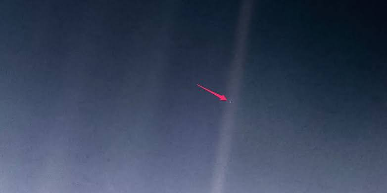

# The Pale Blue Dot: Insignificance, Transcendence, and the Question of a Son

> **About this document.** A reflection built around the most humbling photograph ever
> taken — Voyager 1's 1990 image of Earth as a single pale pixel — and the argument it is
> said to support: that on so small a stage, in so vast a universe, there is no God, or at
> least no God who would concern Himself with this speck, and certainly none who would
> arrange to have a son born upon it. The essay takes the objection seriously, then sets
> against it the Quran's own vocabulary of scale: a God for whom "there is nothing like,"
> whose seven heavens are the greater creation, and for whom the question is not whether He
> would notice a speck of dust but whether making the speck, or making the man, was the
> harder work. Quranic quotations follow Mustafa Khattab's *The Clear Quran*, as cited to
> quran.com; the photograph is cited to NASA/JPL. Researched Sept. 2026.

## Contents

- [1. The Photograph](#1-the-photograph)
- [2. How Small We Are](#2-how-small-we-are)
- [3. The Argument from Insignificance](#3-the-argument-from-insignificance)
- [4. Nothing Is Like Him](#4-nothing-is-like-him)
- [5. Could God Have a Son?](#5-could-god-have-a-son)
- [6. Which Is Harder to Make: You, or the Seven Heavens?](#6-which-is-harder-to-make-you-or-the-seven-heavens)
- [7. The Verdict of the Quran on Smallness](#7-the-verdict-of-the-quran-on-smallness)
- [Sources and Images](#sources-and-images)

---

## 1. The Photograph

On February 14, 1990, at the request of Carl Sagan, NASA turned the camera of the **Voyager 1**
spacecraft back toward home. Voyager was then about **6 billion kilometers** (3.7 billion
miles) from Earth, past the orbit of Neptune and climbing out of the solar system. The
spacecraft took a series of frames that became the "Family Portrait" of the solar system —
and one of them, at first glance, looked like nothing at all.

In the published image, Earth is a single pale point of light caught in a band of scattered
sunlight — an artifact of the camera's optics, a lens flare, a shaft of glare. Of the 640,000
pixels composing the frame, Earth occupies less than one: **about 0.12 of a pixel**. The
photograph became known as the **Pale Blue Dot**, and NASA republished a reprocessed version
on the thirtieth anniversary in February 2020.

Sagan drew from it the reflection that made it famous:

> "Look again at that dot. That's here. That's home. That's us. On it everyone you love,
> everyone you know, everyone you ever heard of, every human being who ever was, lived out
> their lives... on a mote of dust suspended in a sunbeam."

*The Pale Blue Dot: Earth as a fraction of a pixel, photographed by Voyager 1 on Feb. 14,
1990, from roughly 6 billion kilometers away.*

## 2. How Small We Are

The photograph understates our smallness, because 6 billion kilometers is nothing.

- **Within the solar system**, Voyager 1 was still a neighbor. Light needs over five and a
  half hours to cover the distance the photograph crossed; light crosses our own galaxy in
  about 100,000 years
- **Within the galaxy**, the Sun is one star among an estimated 100 to 400 billion, and our
  whole solar system fits in a quiet suburb of the galactic disk
- **Within the universe**, modern surveys place the observable universe at roughly two
  trillion galaxies, each with hundreds of billions of stars. If the Milky Way were the size
  of North America, the whole of human radio broadcasting would be a bubble a few hundred
  meters wide
- **Within physics**, the Quran's own image is blunter than any telescope: humanity was
  fashioned from a despised fluid, from a *sperm-drop* — and the species that issues from
  that origin argues about its Maker. Quran 36:77 asks the species to weigh exactly this:
  do people not see that We created them from a sperm-drop, and behold, they openly
  challenge Us?

## 3. The Argument from Insignificance

From the photograph, a famous inference has been drawn. The universe is unimaginably larger
than the stage on which humanity performs; the stage is a grain of dust; a grain of dust
cannot be the point of a two-trillion-galaxy construction; therefore there is no Creator with
purpose, or if some force started the machine, it takes no notice of us.

A sharper version of the same argument is the one this document is concerned with — and it
comes not from the atheist but from within the family of faiths that look to the same
Abraham. God is asked to have taken on the fullness of human nature, to have been born as an
infant, breathed, eaten, suffered, and died — on *this*. On one planet, one species, one
corner of one galaxy, among two trillion galaxies. Would the Maker of all that choose to send
His own son — Himself, in the Christian formulation — to live and die on a speck of dust
suspended in a sunbeam? The smallness of the stage is offered as the reductio: the story is
too parochial for the size of the universe.

The objection deserves a serious answer, because it takes scale with full seriousness — and
so does the Quran. But the Quran's answer does not run the way the objection assumes.

## 4. Nothing Is Like Him

The objection works only against a god who is *somewhere* — a being inside the universe,
however vast, who must travel, descend, or incarnate to reach a particular spot. Against
such a being, the two-trillion-galaxy argument lands: what interest could a resident of the
cosmos take in one pixel of it?

The God the Quran announces is not that kind of being. **Quran 42:11** states it in four
Arabic words:

> There is nothing like Him, for He ˹alone˺ is the All-Hearing, All-Seeing.

He is neither inside space nor beside it, for space itself is His creature — the seven
heavens are *built* (79:27), *raised* (55:7), still *expanding* (51:47), and on the Last Day
to be *folded like the folding of a scroll* (21:104). A thing that can be rolled up does not
contain its Maker. **Quran 2:255** closes the circle: His Throne *encompasses* the heavens
and the earth — not the reverse.

This is why the smallness argument misses the God of the Quran at every step:

- **He does not need to travel.** The distance from here to the edge of the observable
  universe is real for spacecraft and light; it is not a distance anyone crosses to get from
  God to us, for He is not at the far end of it. He is with you wherever you are (57:4) —
  the verse that terrifies the tyrant and comforts the desperate alike
- **He does not need to be near to attend.** The divine command descends among the heavens
  and the earth (65:12) the way an author's decision moves a plot: not by pilgrimage but by
  authority. His management of two trillion galaxies and one photon's path costs Him the
  same — nothing: when He wills a thing, His command is only to say to it "Be," and it is
  (36:82)
- **Scale is His instrument, not His problem.** The Quran never apologizes for the size of
  creation; it points at it — the creation of the heavens and the earth is greater than the
  creation of humanity, but most people do not know (40:57)

So when the objection asks how the Maker of the vastness could care about a speck, the
Quran's answer is that the question mislocates Him. The real question is not whether God
would *notice* the speck. It is what kind of being God is — and whether such a being would,
or could, have a son.

## 5. Could God Have a Son?

This is where the Quran is at its most severe, and the severity is the argument. The passage
is Surah Maryam, the chapter that itself narrates the virgin birth of Jesus with full
honor:

> **(88)** And they say, "The Most Compassionate has offspring."
>
> **(89)** You have certainly made an outrageous claim,
>
> **(90)** by which the heavens are about to burst, the earth to split apart, and the
> mountains to crumble to pieces,
>
> **(91)** in protest of attributing children to the Most Compassionate.
>
> **(92)** It does not befit ˹the majesty of˺ the Most Compassionate to have children.
>
> **(93)** There is none in the heavens or the earth who will not return to the Most
> Compassionate in full submission.

*(Quran 19:88-93)*

Note what the passage does with the scale argument — it inverts it. The heavens are not
indifferent to the claim of a divine son; they are *about to burst* at it. The universe the
objection invokes as evidence against God's interest is here personified as appalled by a
theological error about God's nature.

The logic behind the severity is the logic of 42:11:

- **A son resembles his father, and is preceded by him.** He has never had offspring, nor
  was He born, and there is none comparable to Him (112:3-4). To beget is to reproduce a
  nature — to pass on what one is. But nothing in creation resembles God ("nothing is like
  Him"), so nothing could carry His nature, and nothing preceded Him to beget it
- **A son belongs to a species.** To give God a son is to give Him a genus — to make Him a
  member of a kind, one instance of something, countable among others. The Quran's God is
  not one being among beings; He is the ground of there being beings at all
- **A son dies.** This is the sharpest point against the photograph. To send a son to a
  speck of dust is to send Him into hunger, thirst, wounds, and the grave — to subject the
  Absolute to the fate of one species on one planet. The Quran answers that it does not
  befit the majesty of the Most Compassionate to have children — and it adds the standing
  relation that replaces it: every being in the heavens and the earth returns to the Most
  Compassionate in full submission (19:93) — in the Arabic, *'abdan*, as a servant.
  Servanthood, not sonship, is the relation between the Maker of two trillion galaxies and
  every creature in them — including Jesus, whom the Quran honors as His messenger and word,
  born of the Virgin, and whom it forbids us to rank with his Lord (4:171)

The objection said: too small a stage for an incarnation. The Quran agrees with the instinct
and rejects the conclusion: *no* stage, however large, could host it, because the thing
proposed is a contradiction — the Unbegotten begotten, the Unmade made, the Sustainer of the
heavens in need of His mother's milk on a dust-mote. The size of the universe was never the
obstacle. The nature of God was.

## 6. Which Is Harder to Make: You, or the Seven Heavens?

The objection from scale assumes that small means cheap — that a being who made two trillion
galaxies could hardly bother with one species on one grain of it. The Quran meets the
assumption head-on and flips it into a question:

> **Which is harder to create: you or the sky? He built it, raising it high and forming it
> flawlessly.**

*(Quran 79:27-28)*

And it gives the answer in another passage:

> **The creation of the heavens and the earth is certainly greater than the re-creation of
> humankind, but most people do not know.**

*(Quran 40:57)*

Two things should be noticed about what the Quran is doing here.

First, it agrees with the telescope: the heavens are the *greater* work. The Quran has no
interest in flattering humanity with cosmic centrality. The seven heavens are described with
the vocabulary of engineering — built, raised, formed, expanded — and layered: He created
seven heavens, one above the other, with no imperfection visible in the creation of the Most
Compassionate; look again — do you see any flaws? — and the command to keep looking ends
only when the sight returns humbled and exhausted (67:3-4). The scripture that predicted the
humbled gaze of every astronomer wrote fourteen centuries before Voyager. (Classical
exegesis, such as Ibn Kathir on 40:57, reads the comparison as covering creation and
re-creation alike; the point stands on either reading.)

Second, it denies the conclusion the objection draws. Yes, the universe is the greater
creation — and *that is precisely why your existence is a sign and not an accident*. If the
greater work is effortless for Him — His command to a thing, when He wills it, is only "Be,"
and it is (16:40) — then the small work is not beneath His attention; it is evidence of His
subtlety. The Quran points at the humiliating origin and says: look at what He builds from
what you would discard. Does man think he will be left neglected? Was he not a sperm-drop
emitted? (75:36-37). And: He created you in the wombs of your mothers, creation after
creation, in threefold darkness (39:6) — the most hidden manufacturing in the universe,
performed without machinery, in every living woman, while two trillion galaxies turn.

The heavens declare the *power*; the sperm-drop declares the *art*. A God who can say "Be"
to a universe can say it to a cell — and the cell, with its coded self-replication, is the
closer miracle to home, which is why the Quran keeps returning to it as the proof the objector
is standing inside of: and in yourselves — do you not see? (51:21).

The seven heavens are named once for what they are in the system:

> **Allah is the One Who created seven heavens ˹in layers˺, and likewise for the earth. The
> ˹divine˺ command descends between them so you may know that Allah is Most Capable of
> everything and that Allah certainly encompasses all things in ˹His˺ knowledge.**

*(Quran 65:12)*

The purpose clause is the whole answer to the photograph: the heavens are a *delivery system
for command and knowledge*, not a monument to scale, and no pixel of any one of them is too
small for the command to descend upon.

## 7. The Verdict of the Quran on Smallness

So the Quran does not argue that we are big. It agrees with Voyager that we are a mote of
dust — it merely denies that the mote is unattended, and it forbids the inference from size
to meaning:

- **Smallness is our status, stated by revelation, not discovered by probe.** Has there come
  upon man a span of time when he was not a thing even mentioned? (76:1). The species was
  not only small in space but absent from speech — nothing worth a word — and was then given
  mention, honored above much of creation (17:70)
- **Significance in the Quran is assigned by command, not measured in pixels.** The Kaaba is
  a small stone building; the Night of Decree is "better than a thousand months" (97:3);
  value in this system is top-down, decreed by the Maker, never voted by mass
- **The correct response to the photograph is in the scripture.** Indeed, in the creation of
  the heavens and the earth and the alternation of the day and night there are signs for
  people of reason (3:190) — and their reflection does not end in "therefore no one is
  home"; it ends in the prayer that their Lord did not create all this without purpose
  (3:191), and in the humbling of the one who looks
- **And the escape from insignificance is not a son sent down, but a trust taken on.** We
  offered the trust to the heavens and the earth and the mountains, but they all declined to
  bear it, being fearful of it; but humanity assumed it (33:72). The two-trillion-galaxy
  universe declined the burden of moral accountability; the dust-mote accepted it. In the
  Quran's accounting, that makes the pale blue dot — for all its 0.12 of a pixel — the most
  consequential address in the visible creation

The photograph shows exactly what the scripture always said we are. It is the atheist who
must argue that the scripture is wrong about what we are *for*.

---

## Sources and Images

- [Pale Blue Dot, NASA Science / Photojournal, "Pale Blue Dot Revisited"](https://science.nasa.gov/photojournal/pale-blue-dot-revisited/) — the 2020 reprocessing of the Feb. 14, 1990 image (PIA00452), from roughly 6 billion km, Earth occupying about 0.12 of a pixel of the 640,000-pixel frame
- [Space.com, "Voyager 1 Signal from Interstellar Space Seen from Earth"](https://www.space.com/22787-voyager-1-signal-interstellar-space-photo.html) — source of the research note this document grew from
- Carl Sagan, *Pale Blue Dot: A Vision of the Human Future in Space* (1994) — the "mote of dust suspended in a sunbeam" passage, quoted in excerpt
- Quranic text: [quran.com](https://quran.com/), Mustafa Khattab, *The Clear Quran* — [19:88-93](https://quran.com/19/88-92), [36:77-79](https://quran.com/36/77-79), [42:11](https://quran.com/42/11), [112:1-4](https://quran.com/112/1-4), [79:27-28](https://quran.com/79/27-28), [40:57](https://quran.com/40/57), [65:12](https://quran.com/65/12), [67:3-4](https://quran.com/67/3-4), [51:47](https://quran.com/51/47), [51:21](https://quran.com/51/21), [36:82](https://quran.com/36/82), [16:40](https://quran.com/16/40), [21:104](https://quran.com/21/104), [2:255](https://quran.com/2/255), [57:4](https://quran.com/57/4), [39:6](https://quran.com/39/6), [75:36-37](https://quran.com/75/36-37), [76:1](https://quran.com/76/1), [97:3](https://quran.com/97/3), [17:70](https://quran.com/17/70), [33:72](https://quran.com/33/72), [55:7](https://quran.com/55/7), [3:190-191](https://quran.com/3/190-191), [4:171](https://quran.com/4/171). Block quotations are exact; shorter references are paraphrased to the same translation.

Local images referenced:

- `images/earth/Pale Blue Dot 2 - Voyager 1 Signal from Interstellar Space Seen from Earth.png` — embedded above
- `images/earth/earth-as-spec-in-space-1.jpeg`, `earth-as-spec-in-space-2.jpeg`, `earth-as-spec-in-space-3.jpeg` — additional Earth-as-speck views from the same research batch

